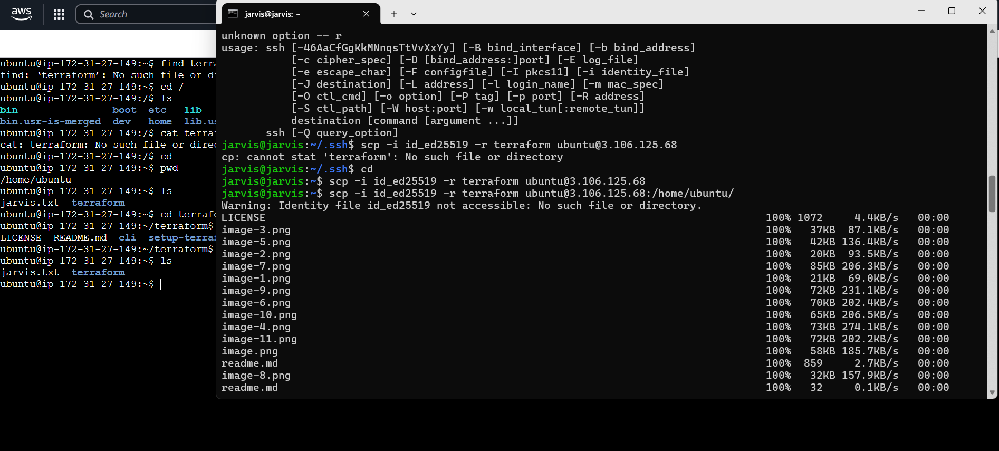

# In this practice we used scp 

we are going to connect ec2 to local host

- going to login ec2 in local host
- create sshkey in local host
- save the pub_key in ec2 > authorized_keys
- use scp command with -i(flag to use private key to login)
- `scp -i privatekey -r folder(source) ubuntu@public-ip: /home/ubnuntu(destination)` We have to use -r flag for folder
- `scp -i privatekey test.txt(source) ubuntu@public-ip: /home/ubnuntu(destination)` No flag required for file.
---

