**Created a log file.**

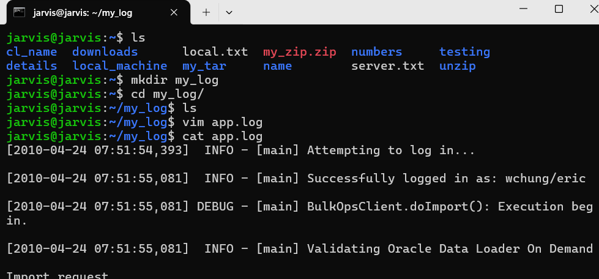


**Simple format**
`awk 'commadn' filename`
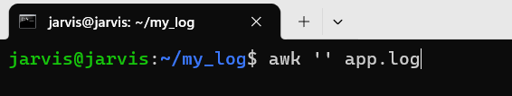
`awk '{print}' app.log`
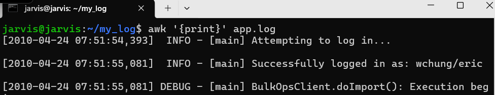

**Appyling filters**

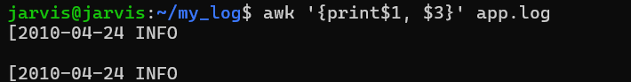

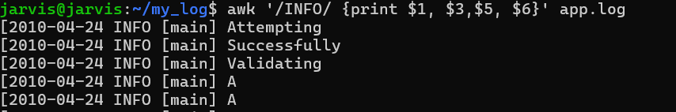

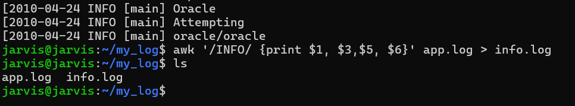

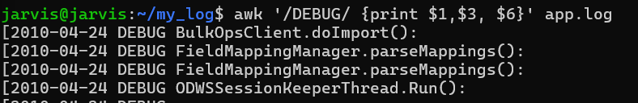


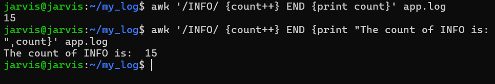

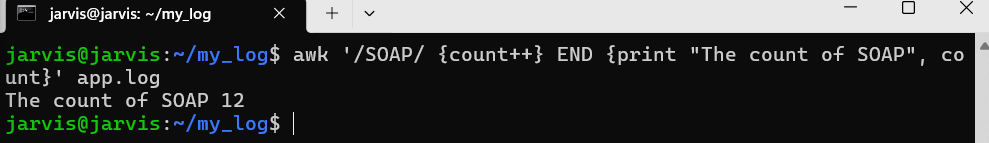

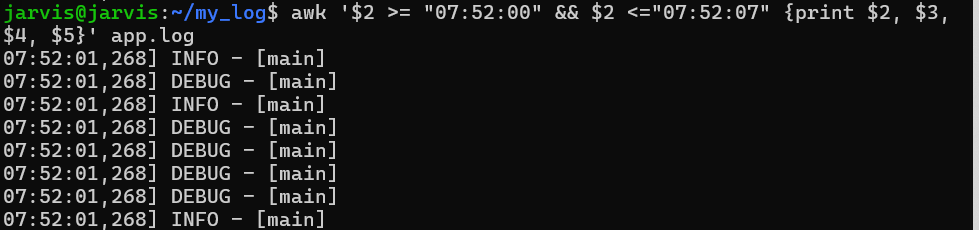


---
`awk '/Feb/ {count++} END {print"Count of Feb in app file is:"", count}' app.log`

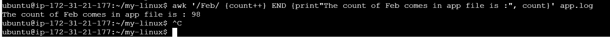


**Using case add-ons**

- For searching specific pattern then listing the number of list using wc -l

```
awk ' /error/ {print} ' my.log | wc -l
```
```
awk ' /error/ && /ERROR/  {print} ' my.log | wc -l
```

- awk with NR use case

This will print first 5 lines of row
```
awk ' NR==5 {print} ' my.log | wc -l
```
This will print lines after row 5 upto the row 15
```
awk ' NR>=5 && NR<=15 {print} ' my.log | wc -l
```
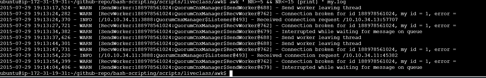

- This will look for specific pattern and specific date in the column number 1 then will give first 5 output

```
awk '/WARN/ &&  $1=="2015-07-29"  {print}' my.log | wc -l
awk '/WARN/ &&  $1=="2015-07-29"  {print}' my.log | head -5
```

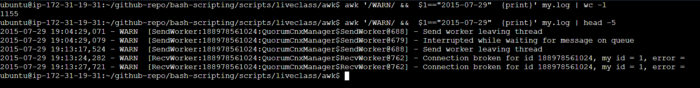