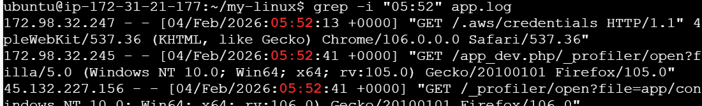
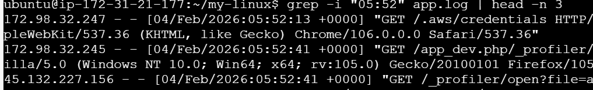

# Examples & Practice

## filtering using -i flag for make caseinsensitive string

`grep -i "string error" filename.txt `

## filtering result using | head -n 3

`grep -i "string error" filename.txt | head -n 3`

