# Adding EC2 volume to linux machine

## Two methods we can use
- lvm (pvs, vgs, lvs )
- Direct mount


### - lvm (pvs, vgs, lvs )
Run: 
`lsblk`
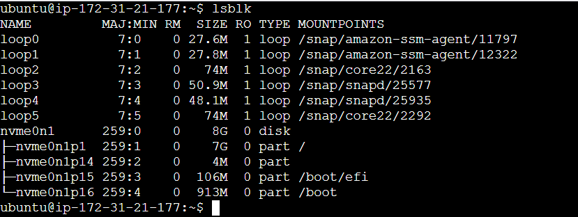
`pvs`

`vgs`

`lvs`
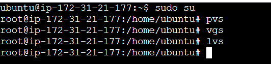

`df -h`
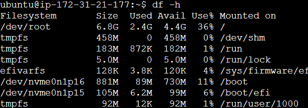


### Created elastic volume in aws
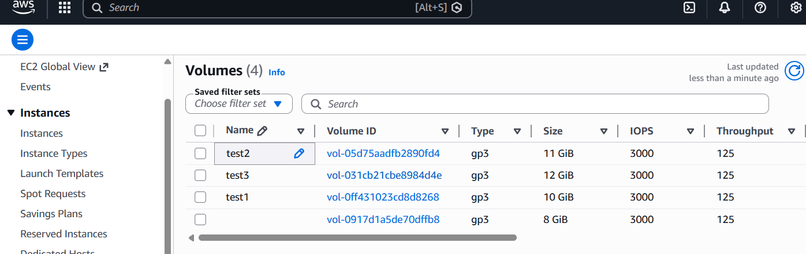


### Attached the volume to linux machine
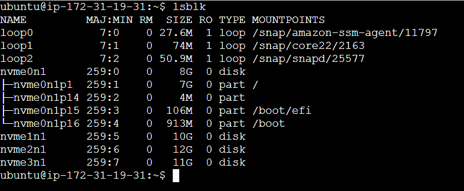

### Task 2: Create Physical Volume
```bash
pvcreate /dev/sdb   # or your loop device
pvs
```
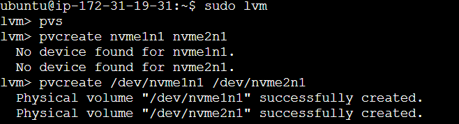


### Task 3: Create Volume Group
```bash
vgcreate devops-vg /dev/sdb
vgs
```
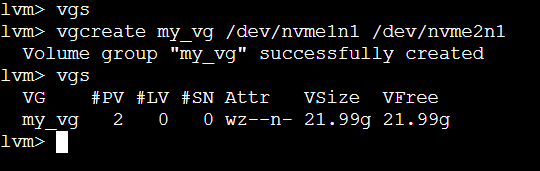

### Task 4: Create Logical Volume
```bash
lvcreate -L 500M -n app-data devops-vg
lvs
```
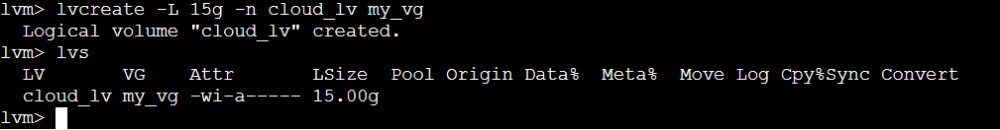

### Task 5: Format and Mount
Before mount df -h 
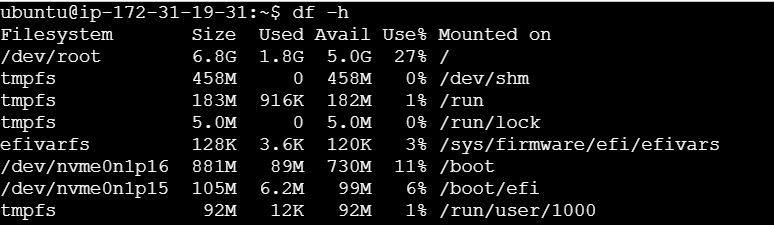

mkfs.ext4 /dev/devops-vg/app-data
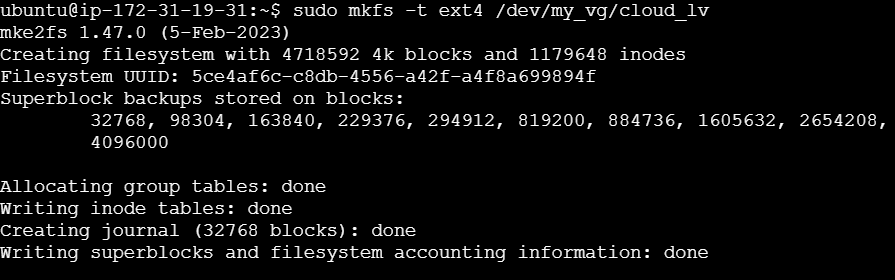
mkdir -p /mnt/app-data


mount /dev/devops-vg/app-data /mnt/app-data
df -h /mnt/app-data
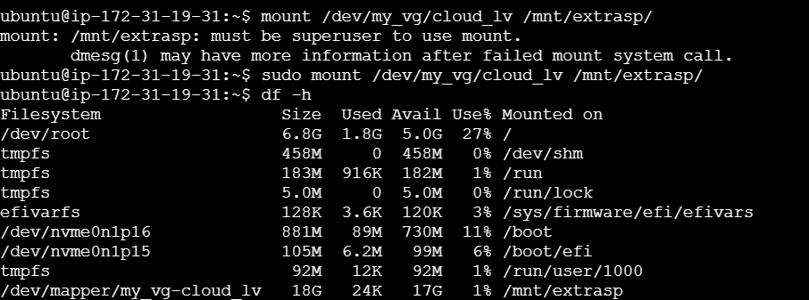


### Task 6: Extend the Volume
```bash
lvextend -L +200M /dev/devops-vg/app-data
resize2fs /dev/devops-vg/app-data
df -h /mnt/app-data
```

### Task 6: Extend the Volume


After extending
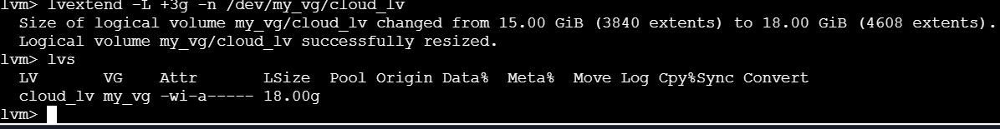

---

### Direct mount
before mount
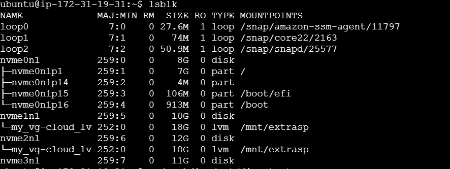

making dir and formatting disk
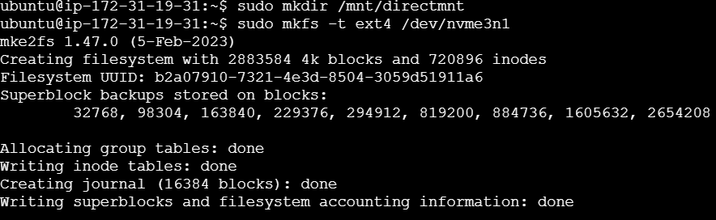

Disk mounted and showing status
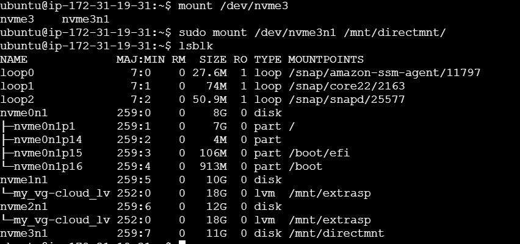
---


### sudo umount /mnt/mountname

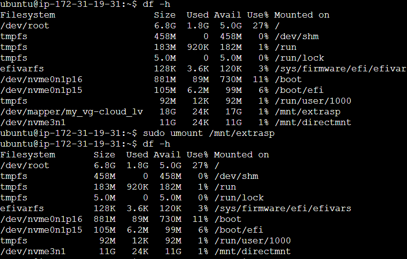

---
