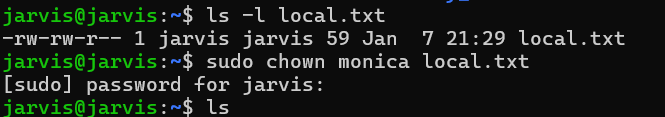
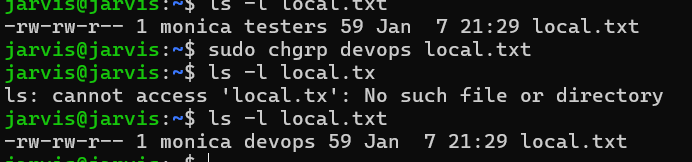

# File Permissions

Linux uses permissions to control access to files and directories.

---

## 🔹 Permissions Explained

| Permission | Meaning |
|-----------|---------|
| r | Read |
| w | Write |
| x | Execute |
| d | Directory |


Example:
-rwxr-xr--
 = 754


### `chmod`
Change permission:

Example:


```
chmod 755 filename
```

### `chown`
Change owner:
```
sudo chown user:group file.txt

```


### `umask`
User File Creation Mode Mask
Default value = 0002

Example:
```
umask
```


### `chgrp`
To change the group of file.

Example:


```
sudo chgrp devops test.txt
```

