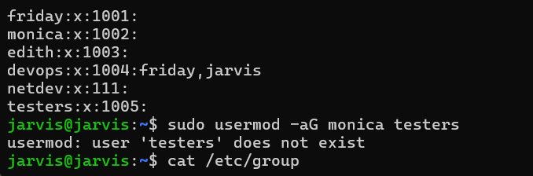
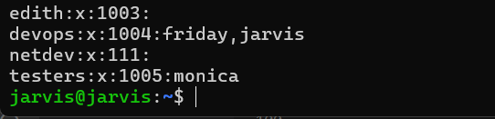

# User & Group Management

Learn how to list, create, and manage users and groups.

### `whoami`
Displays current logged-in user.

### `id`
Shows user/group identity.

### `useradd`
Creates a user account only. Does NOT create a home directory by default. Home directory like /home/username will not exist
Useful for system users or service accounts

User exists

No personal files, no .bashrc, .profile, etc.

Example
```
sudo useradd newuser

```
### `useradd -m username`

Creates a user account. 
Creates a home directory (usually /home/username).
Copies default config files from /etc/skel

User exists

Home directory with standard shell configs.

Example
```
sudo useradd -m newuser
```


### `userdel -r username`
Deletes the user and their home directory

Example:
```
userdel -r username
```


### `userdel`
Deletes the user only (home directory stays)

Example:
```
sudo userdel username

```
### `userdel`
Deletes the user only (home directory stays)

Example:
```
sudo userdel username

```

### `cat /etc/passwd`
Displays all user accounts on the system

Shows user details like:

Example:
```
cat /etc/passwd
username:x:UID:GID:comment:home_directory:login_shell

```

### `sudo passwd user`
set/change a user password

Example:
```
sudo passwd user

```
### `su`
To switch to another user


Example:
```
su friday
```
---

### `sudo groupadd name` creating group
To create the Group

Example:
```
sudo groupadd devops
```

### `sudo usermod -aG group user`
To modify user to add in the Group 

Using flag -a Append, G Group( -aG )


Example:
```
sudo usermod -aG testers monica
```


## outcome

### `cat /etc/group`
To check the group name

Example:
```
cat /etc/group
```

### `sudo gpasswd -a username groupname`
To add memebers in the group

`-a` use flag to add

**IMP- More like doing a append job keep the current users**
Example:
```
sudo gpasswd -a jarvis devops
```

### `sudo gpasswd -M user1,user2 groupname`
To add multiple user in the group.


**IMP - It will overright the previous users
It will remove the old users.
Add new users list in the group**
Example:

> make sure there is no gap when entering multi user no space- test1,test2,test3
```
sudo gpasswd -M friday,monica devops

```

### `sudo groupdel groupname`
To delete the group.

Example:
```
sudo groupdel tester
```

---
### `ctrl + r`
To search the previous commands used in terminal.

Example:

```
ctrl + r
```
---