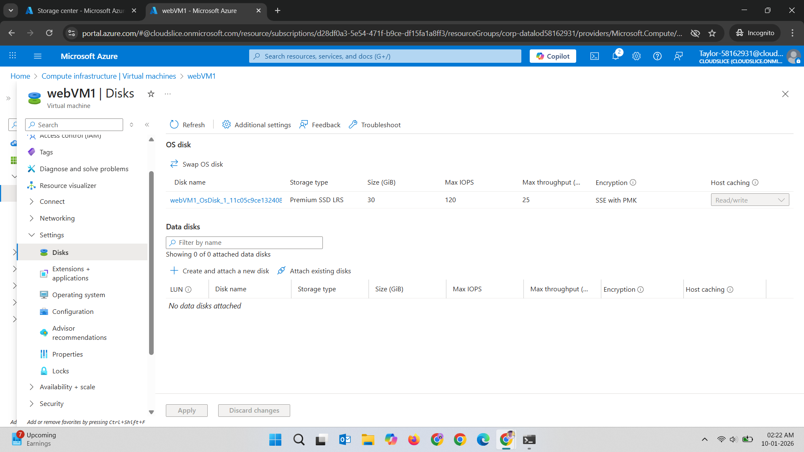
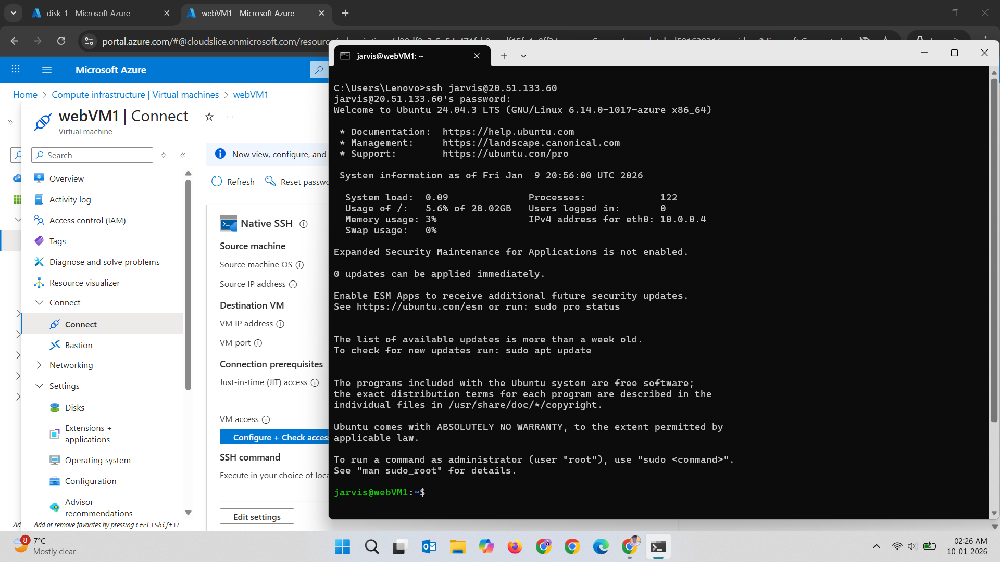
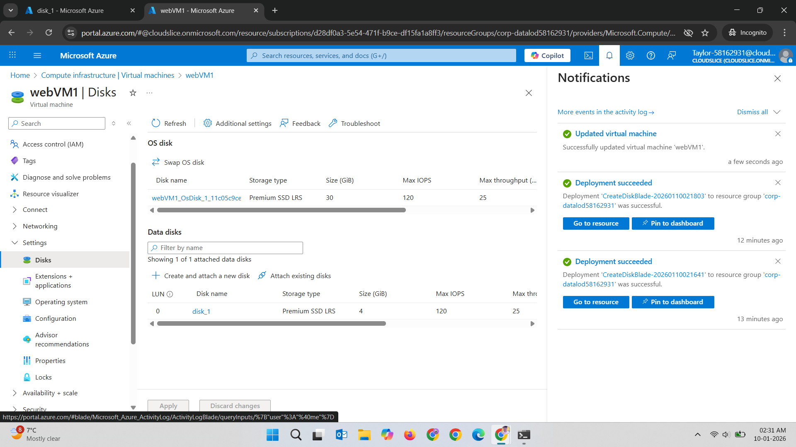
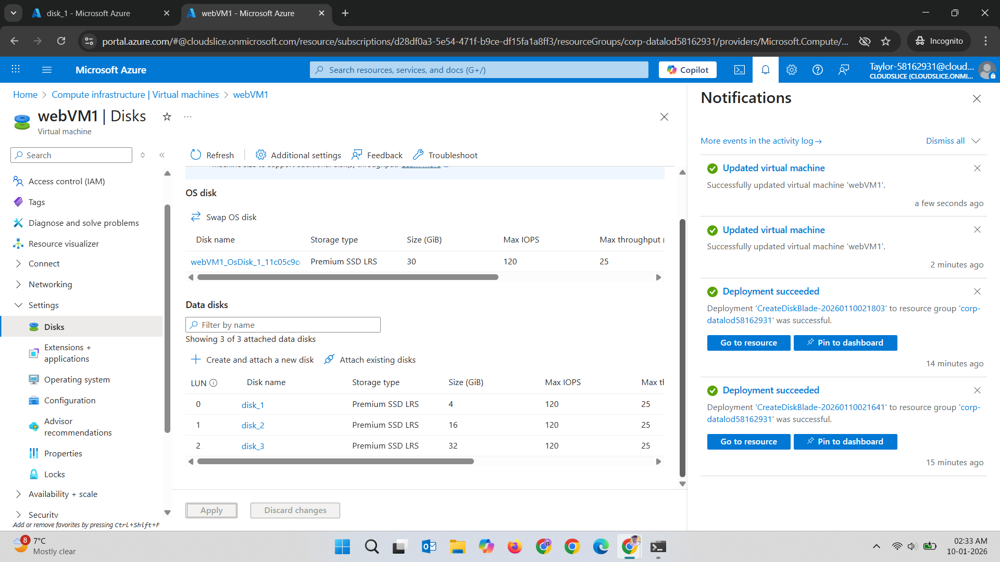
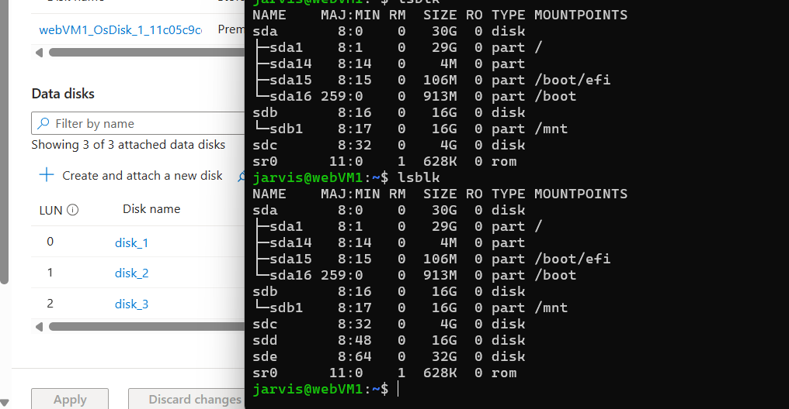
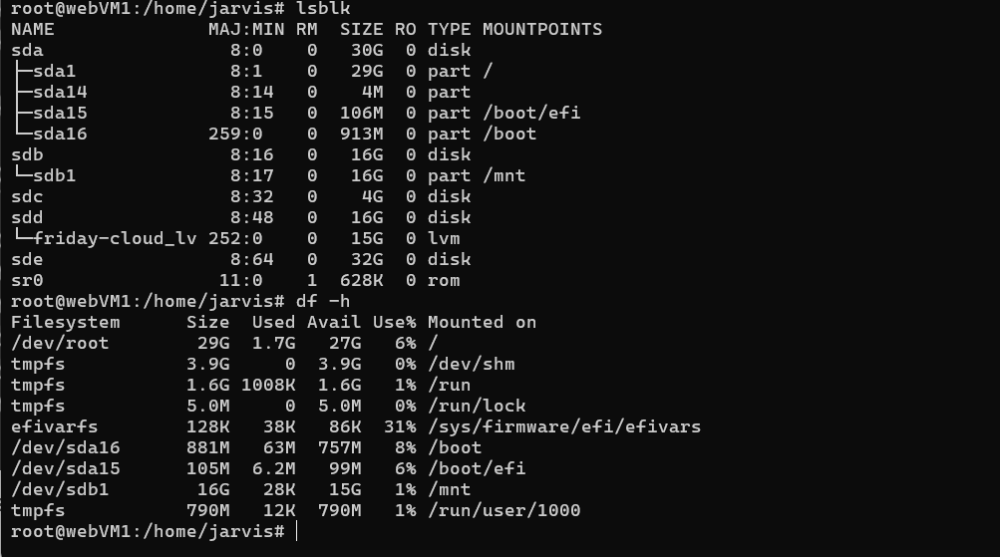
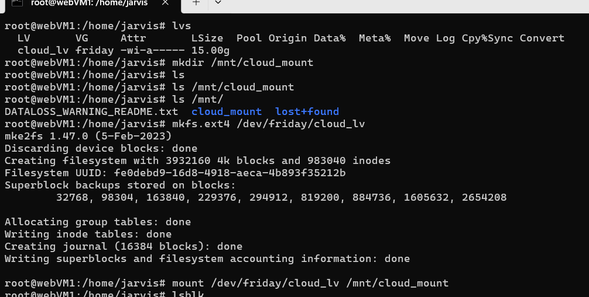
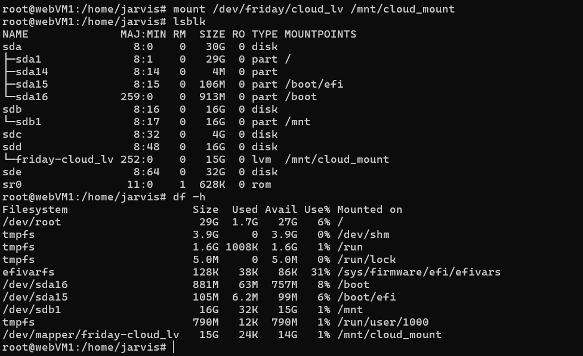
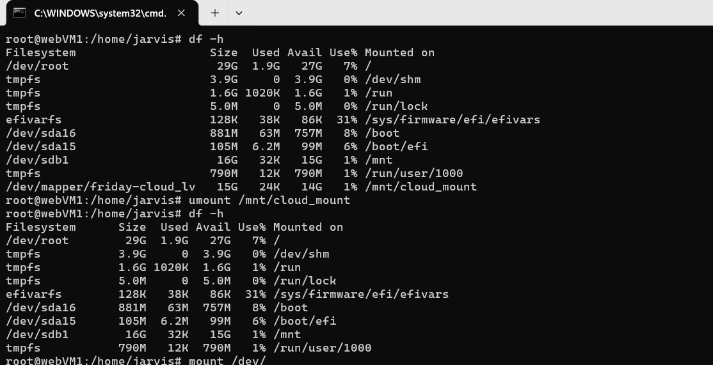
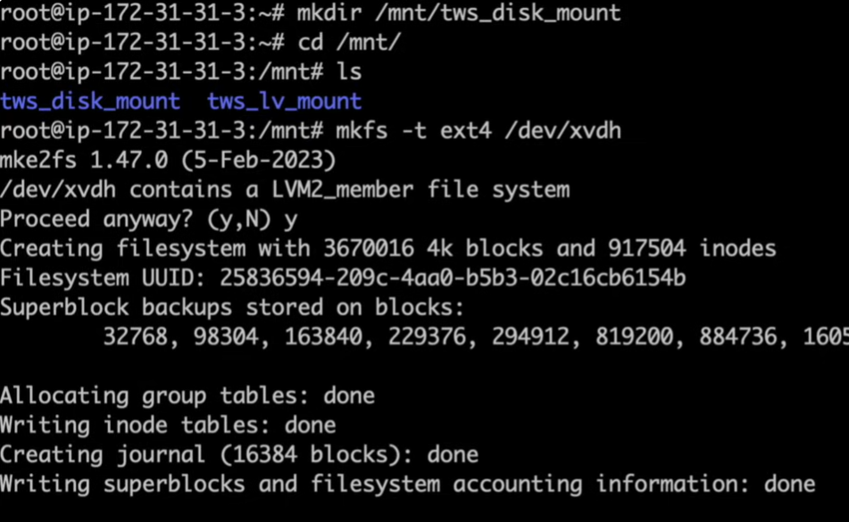

**Created the Linux VM**


---
**VM disk details**



---
**ssh into the VM via public IP**



---
**Initial VM Disk and block devices**


---
**Attached first disk: disk_1**



---
**Status show: sdc**


---
**Attached rest 2 disks: disk_2, disk_3**



---
**Status shows: sdc, sdd, sde**


---

**Creating pv, vg, lv**
- `lvm `: LVM in Linux (Logical Volume Manager)

    some basic commands

    (lsblk
    pvs
    vgs
    lvs
    )
- `sudo su`
- `pvcreate /dev/sdc /dev/sdd /dev/sde`

    create phyical volume of all attached disk.

    example: `sudo pvcreate /dev/sdb
`
- `pvs`: checked the status-all good!

- `vgcreate friday /dev/sdc /dev/sde`
    
    created volume group name "friday"
    
    example: `sudo vgcreate vgdata /dev/sdb`

- `vgs`: checked the statu - all good!

- `lvcreate -L 15G -n cloud_lv friday`

    created logical volume of 15 Gb name :cloud_lv in friday (volume group)

- `exit` 

    exit from `lvm` to the status.

Some other command we can use in  `terminal` But it works only if LVM is in use.
```
pvdisplay
vgdisplay
lvdisplay
```

**Status: vg and lv shows**
Good work!



**Making disk dir, disk format, disk mount**
- `lvs` check out logical volume.

- `mkdir /mnt/cloud_mount` 
    
    create a directory in mount to mount the lv.

- `ls /mnt/` Directory is created!

- `mkfs.ext4 /dev/friday/cloud_lv`

    Format the disk/lv

- `mount /dev/friday/cloud_lv /mnt/cloud_mount`

    mount our lv to mountdirectory.


**Checking Result:**


Mount/umount
- `umount /mnt/clound_mount`

    unmount the disk.

-  `mount /dev/friday/cloud_lv /mnt/cloud_mount`

    mounted back.
    
    > There will be no data loss if any file is created in mounted disk. If disk is unmounted and mounted again.

    > File will exits as you mount back the disk.




example: For mounting disk directly disk_3

- `mkdir /mnt/cloud_dataD`

- `cd /mnt/cloud-dataD`

- `mkfs -t ext4 /dev/sde`

    `y` yes to process the format of disk_3
- mount /dev/sde /mnt/cloud_dataD




## **To extend the memory of LV cloud_lv**

- sudo su
- lvm
- lvextend -L +5G -n /dev/friday/cloud_lv


It will add the extra 5 Gb in our lv on availability.

Use below commmands to check the volume update.
- df -h
- lsblk

