## Task

The system admins team want to create a user on an app server in Stratos Datacenter. Create the user as per the details given below:


Create a user named rod with a non-interactive shell on App server 1 in Stratos Datacenter.

## Commands Used

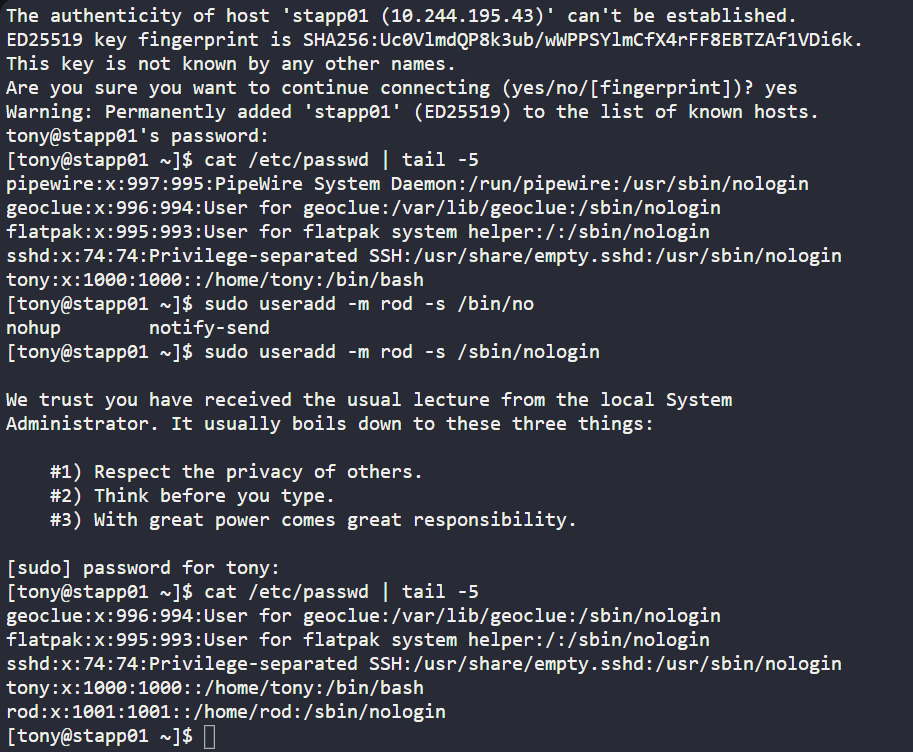
---
## Task

One of the developers at Nautilus has stored sensitive data on the jump host in Stratos DC. This data needs to be transferred to an app server. As developers lack access to the app servers, they've requested the system admin team to complete this task.


Please copy the file /tmp/nautilus.txt.gpg from the jump server to App Server 1 at the following location: /home/webapp.

## Commands Used

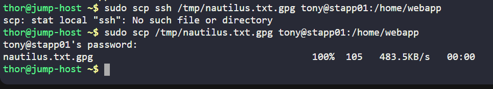

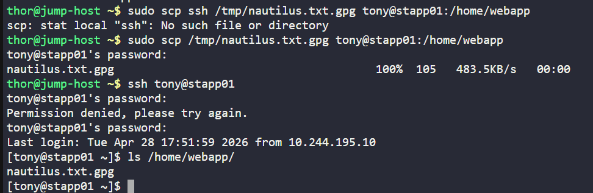
---
## Task
Configure the firewalld rules on the Nautilus application server 1 to allow incoming traffic on port 8084, ensuring the proper functionality of the system in accordance with the security requirements.


Install and enable the firewalld service.
Allow incoming connections on port 8084/tcp.
Ensure the zone is set to public.

## Commands Used

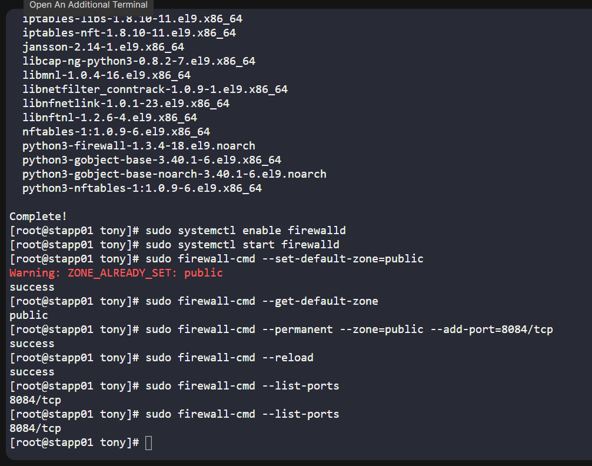
```
sudo systemctl status firewalld
Set default zone to public
sudo firewall-cmd --set-default-zone=public
verify
sudo firewall-cmd --get-default-zone
Allow port 8084/tcp
sudo firewall-cmd --permanent --zone=public --add-port=8084/tcp
Reload firewall:
sudo firewall-cmd --reload
Verify the rule
sudo firewall-cmd --list-ports

```
---

## Task
Some directories and files needed to be created on an app server in Stratos Datacenter. Complete this task as per the details mentioned below:


Create a directory named /opt/dba on App server 1 in Stratos Datacenter.
Further, create a blank file named /opt/dba/dba.txt .

## Commands Used

---

## Task
Some directories and files needed to be created on an app server in Stratos Datacenter. Complete this task as per the details mentioned below:

Create a directory named /opt/dba on App server 1 in Stratos Datacenter.
Further, create a blank file named /opt/dba/dba.txt .

## Commands Used
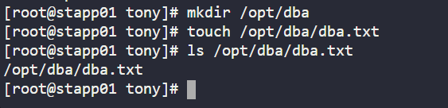
---

## Task
The Nautilus security team performed an audit on all servers present in Stratos DC. During the audit some critical data/files were identified which were having the wrong permissions as per security standards. Once the report was shared with the production support team, they started fixing the issues one by one. It has been identified that one of the files named /etc/hosts on Nautilus App 1 server has wrong permissions, so that needs to be fixed and the correct ACLs needs to be applied.


a. User virat must not have any permission on this file.

b. User vivek should have read only permission on this file. Further, dbadmin group should have read/write permissions on this file.

## Commands Used
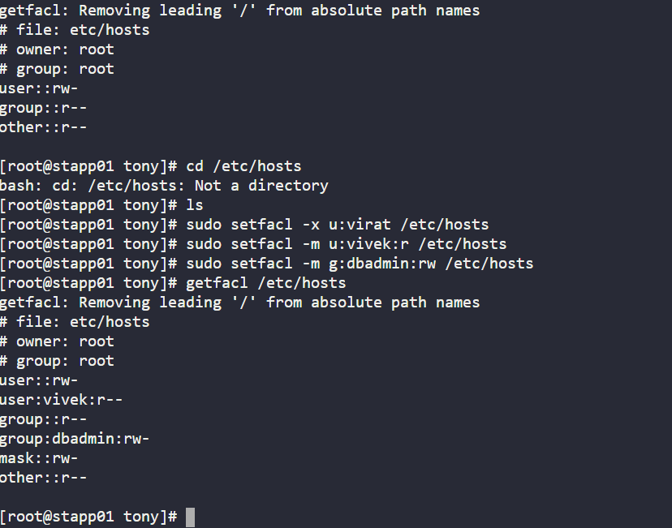

---

## Task
The development team requires specific logs stored within the Nautilus storage server situated in the Stratos DC. Access the designated location on the server to retrieve the necessary logs. Further, perform below actions:


Create a tar archive named logs.tar (under natasha's home) of /var/log/ directory.
Now, create a compressed tar archive as well named logs.tar.gz (under natasha's home) of /var/log/ directory.

## Commands Used

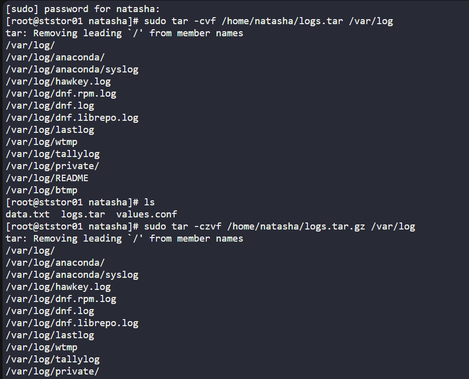
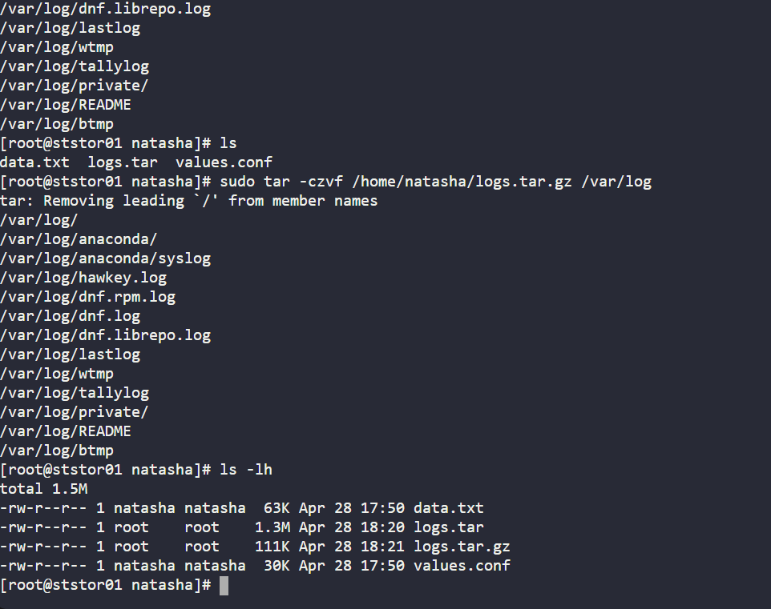

```
    1  sudo tar -cvf /home/natasha/logs.tar /var/log
    2  ls
    3  sudo tar -czvf /home/natasha/logs.tar.gz /var/log
    4  ls -lh
    5  history
```
---

## Task
There is some data on Nautilus App Server 1 in Stratos DC. Data needs to be altered in some of the files. On Nautilus App Server 1, alter the /home/BSD.txt file as per details given below.


a. Delete all lines containing the word code and save the results in /home/BSD_DELETE.txt file. (Please be aware of case sensitivity)

b. Replace all occurrences of the word from (look for the exact match) with them and save the results in /home/BSD_REPLACE.txt file.

Note: Let's say you are asked to replace the word to with from. In that case, make sure not to alter any words containing the string itself, for example; upto, contributor etc.

## Commands Used

```
grep -v 'code' /home/BSD.txt > /home/BSD_DELETE.txt
sed 's/\bfrom\b/them/g' /home/BSD.txt > /home/BSD_REPLACE.txt


cat /home/BSD_DELETE.txt
cat /home/BSD_REPLACE.txt
```
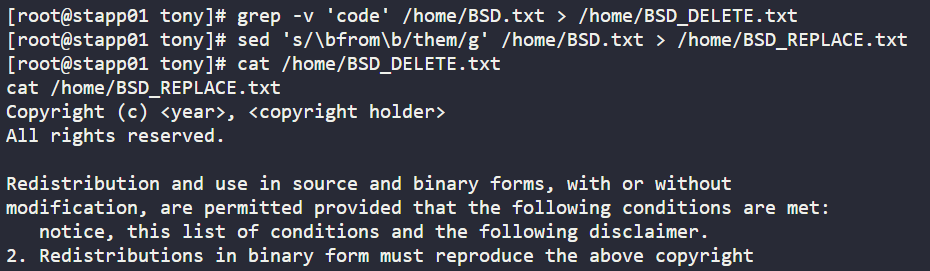
---


## Task

As per a new application requirements shared by the Nautilus application development team, several new packages need to be installed on all app servers in Stratos Datacenter. Most of them are installed except tree.


Therefore, install the tree package on all app servers in Stratos Datacenter.

## Commands Used

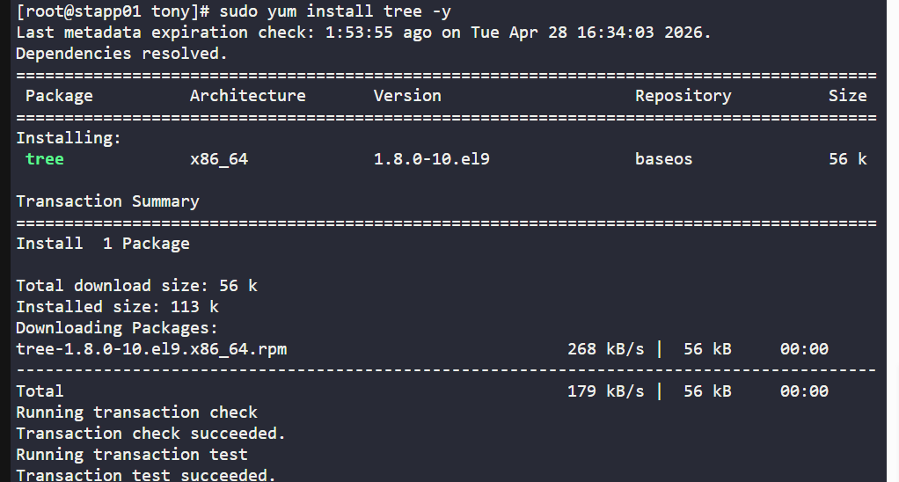
---

## Task

The Nautilus system admins team recently deployed a web UI application for their backup utility running on the Nautilus Backup Server in Stratos Datacenter. The application is running on port 8084. If firewalld is unavailable on the server, install it first. If it is already installed, proceed with the requirements that have come up:


Open all incoming connections on 8084/tcp port, zone should be public.

## Commands Used
```
[clint@stbkp01 ~]$ history
    1  systemctl status firewalld
    2  sudo firewall-cmd --zone=public --list-ports
    3  sudo firewall-cmd --permanent --zone=public --add-port=8084/tcp
    4  sudo firewall-cmd --reload
    5  sudo firewall-cmd --zone=public --list-ports
    6  history
```
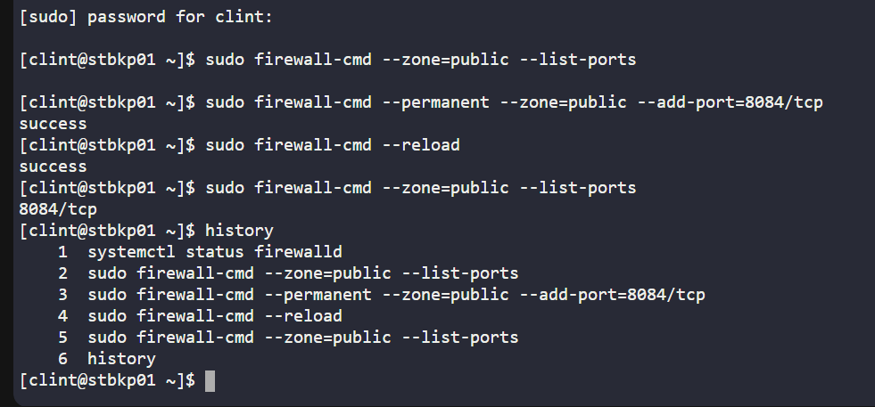
---

## Task
xFusionCorp Industries is planning to host two static websites on their infra in Stratos Datacenter. The development of these websites is still in-progress, but we want to install some prerequisites to get the servers ready. Please perform the following steps to accomplish the task:


Install httpd package and dependencies on app server 1 and start its service.

## Commands Used
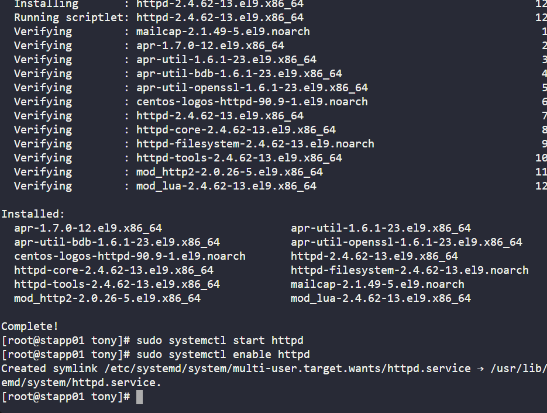


## What I Learned

## Notes


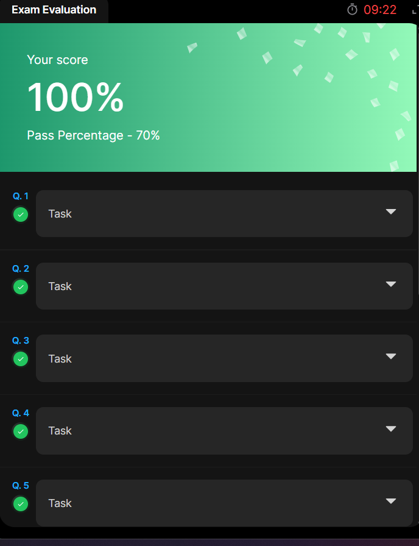


