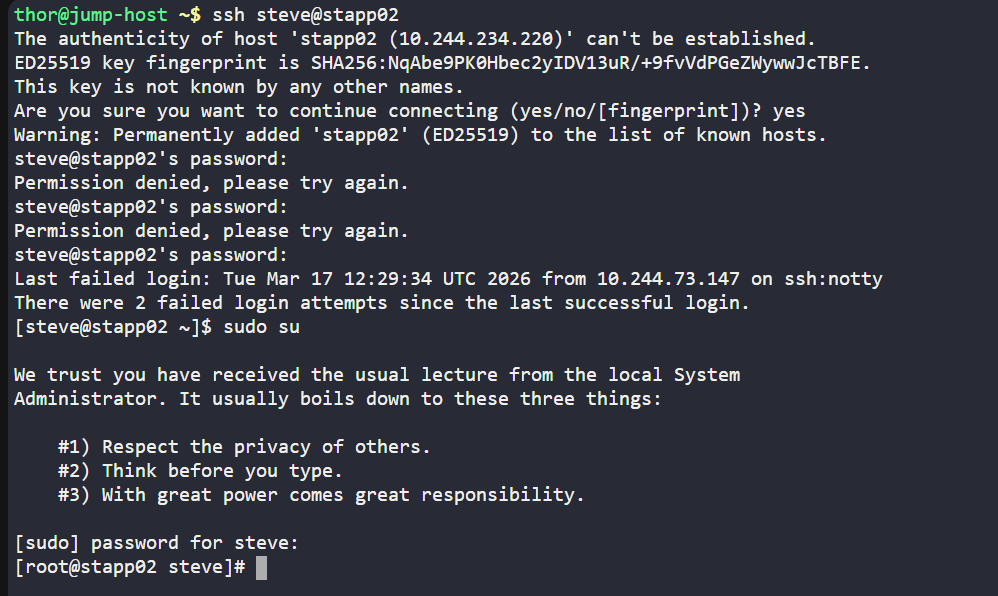
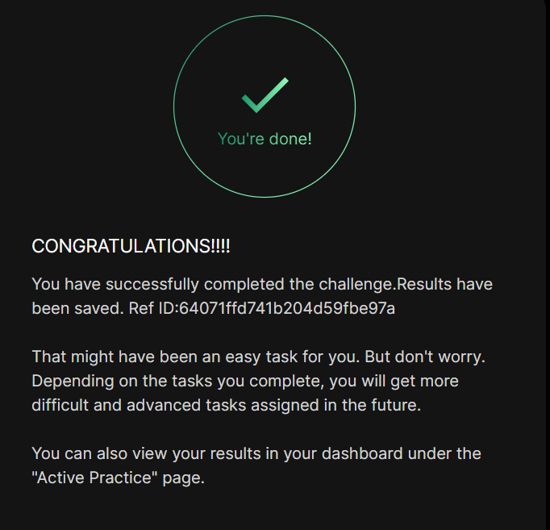

# Day 03 :shipit:

## Task

To accommodate the backup agent tool's specifications, the system admin team at xFusionCorp Industries requires the creation of a user with a non-interactive shell. Here's your task:

Create a user named ammar with a non-interactive shell on App Server 2.

Note: You can find the infrastructure details by clicking on the Details of all Users and Servers button on the top-right section of the page.

## Commands Used

```
useradd -m ammar -s /sbin/nologin
cat /etc/passwd | grep ammar

```

login into the server and switch to root
- 


## What I Learned

- The `useradd` command is used to create new users in Linux.
- The `-m` option creates a home directory for the user automatically.
- The `-s` option specifies the login shell for the user.
- Setting the shell to `/sbin/nologin` creates a **non-interactive user**, meaning the user cannot log in to the system.
- System user details are stored in the `/etc/passwd` file.
- The `/etc/passwd` file can be used to verify if a user was created successfully.

---

## Notes

- A user named **ammar** was created on **App Server 2**.
- The user was configured with a **non-interactive shell** to prevent direct login access.
- The home directory `/home/ammar` was created automatically using the `-m` option.
- Verification was done by checking the `/etc/passwd` file.

