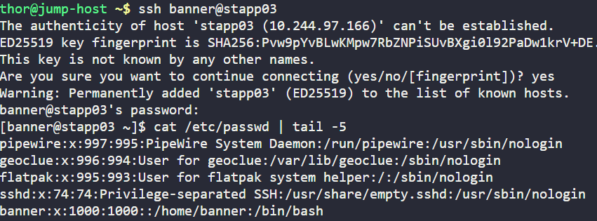
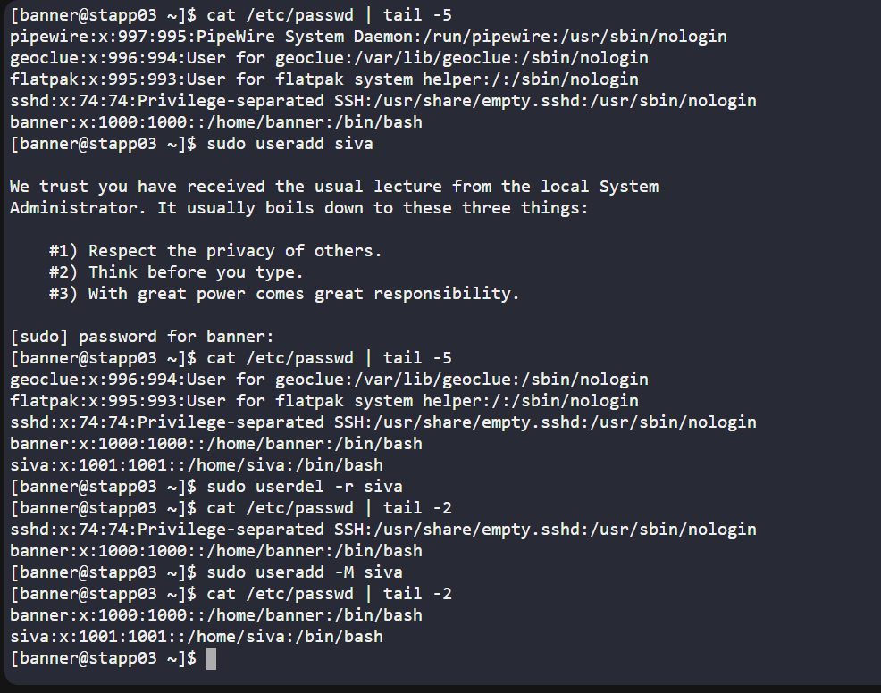
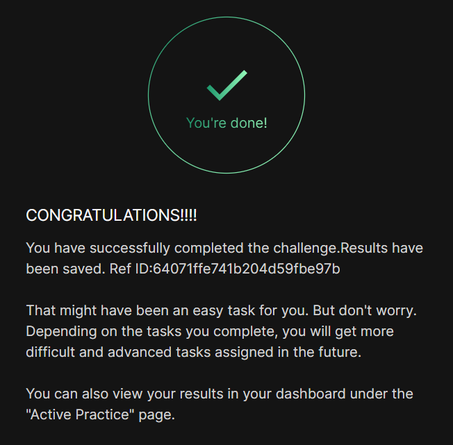

# Day 04 :shipit:

## Task
In response to the latest tool implementation at xFusionCorp Industries, the system admins require the creation of a service user account. Here are the specifics:

Create a user named siva in App Server 3 without a home directory.

Note: You can find the infrastructure details by clicking on the Details of all Users and Servers button on the top-right section of the page.

## Commands Used

ssh into the server check the users
- 

Created user with the no home dir and check the same
- 
## What I Learned

## Notes

