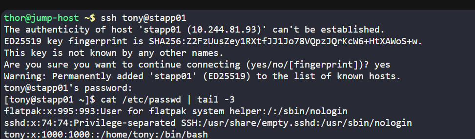
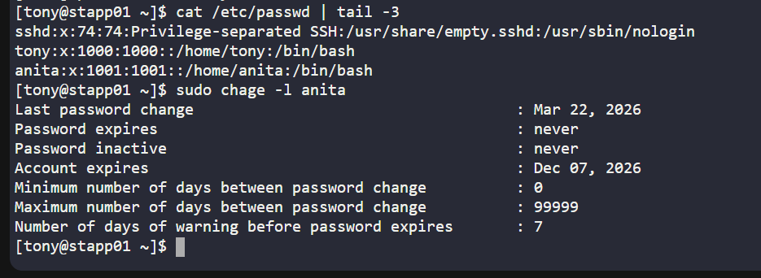
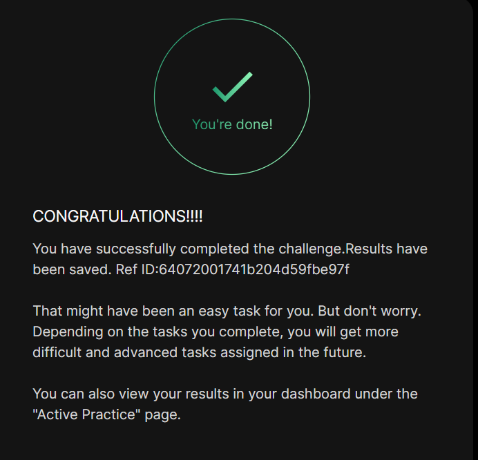

# Day 05 :shipit:

## Task

As part of the temporary assignment to the Nautilus project, a developer named anita requires access for a limited duration. To ensure smooth access management, a temporary user account with an expiry date is needed. Here's what you need to do:

Create a user named anita on App Server 1 in Stratos Datacenter. Set the expiry date to 2026-12-07, ensuring the user is created in lowercase as per standard protocol.

Note: You can find the infrastructure details by clicking on the Details of all Users and Servers button on the top-right section of the page.

## Commands Used

```
ssh tony@stapp01
cat /etc/passwd | tail -3
sudo useradd -e 2026-12-07 anita
cat /etc/passwd | tail -3
sudo chage -l anita
```

ssh into the server and check the current user
- 

create user with the expiry using flag sudo useradd -e YYYY-MM-DD username
- 

check user and expiry details
- 


## What I Learned

- The `ssh` command is used to connect to a remote server.
- `useradd` is used to create a new user in Linux.
- The `-e` option with `useradd` sets an account expiry date.
- `sudo chage -l <username>` is used to verify password and account aging details.
- The `/etc/passwd` file can be checked to confirm that a new user was created successfully.
- An account expiration date controls until when a user account remains active.

## Notes

- Connected to **App Server 1** as user `tony`.
- Created a new user named **anita**.
- Set the account expiry date to **2026-12-07**.
- Verified the user entry in `/etc/passwd`.
- Confirmed the account expiry using `chage -l anita`.



