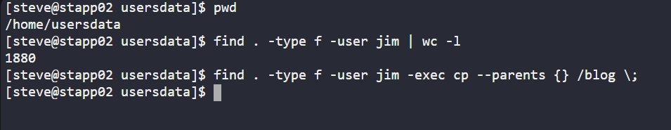
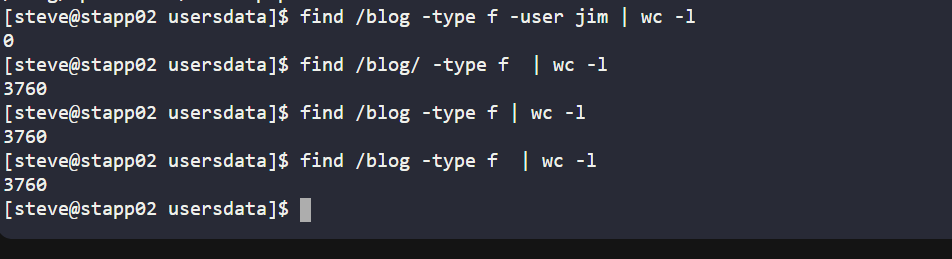
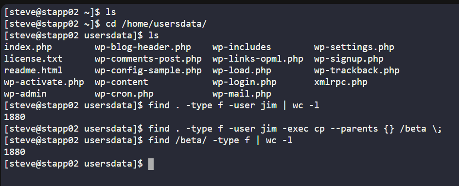

# Day 06 :shipit:

## Task

Due to an accidental data mix-up, user data was unintentionally mingled on Nautilus App Server 2 at the /home/usersdata location by the Nautilus production support team in Stratos DC. To rectify this, specific user data needs to be filtered and relocated. Here are the details:

Locate all files (excluding directories) owned by user jim within the /home/usersdata directory on App Server 2. Copy these files while preserving the directory structure to the /blog directory.

## Commands Used

```
mkdir -p /blog
find /home/usersdata -type f -user jim -exec cp --parents {} /blog \;
find /blog -type f


how this works
find /home/usersdata → searches only there
-type f → files only
-user jim → only files owned by jim
cp --parents → preserves the directory structure under /blog
```

```
mkdir -p /blog
cd /home/usersdata
find . -type f -user jim | cpio -pdm /blog

```

check the file count own by jim and copied to the desired path
- 


verify the same
- 


did again in one go
- 

## What I Learned

- The `find` command is used to search for files and directories in Linux.
- The `-type f` option ensures that only files are selected, not directories.
- The `-user jim` option filters files based on ownership.
- The `cp --parents` command copies files while preserving their original directory structure.
- The `/blog` directory was used as the destination to store only the required user-owned files.
- `wc -l` can be used with `find` output to count how many matching files were found.

## Notes

- Searched inside `/home/usersdata` for files owned by **jim**.
- Copied only files, excluding directories.
- Preserved the directory structure while copying files to `/blog`.
- `cpio` was not available on the server, so `cp --parents` was used instead.
- Verified the copied files using `find /blog -type f`.

