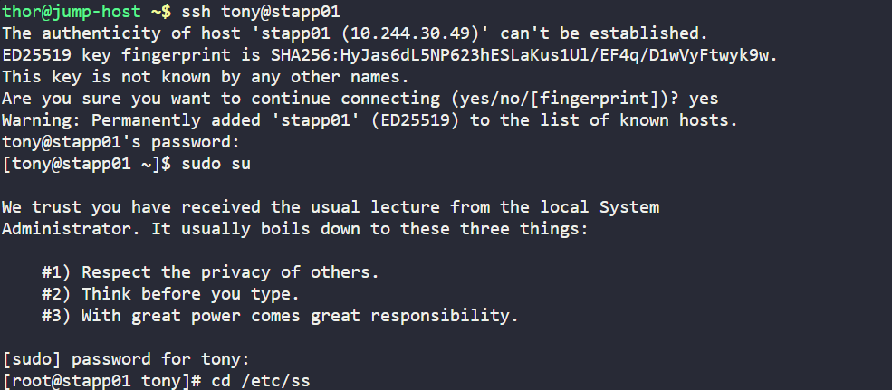
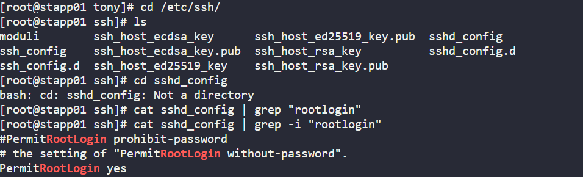
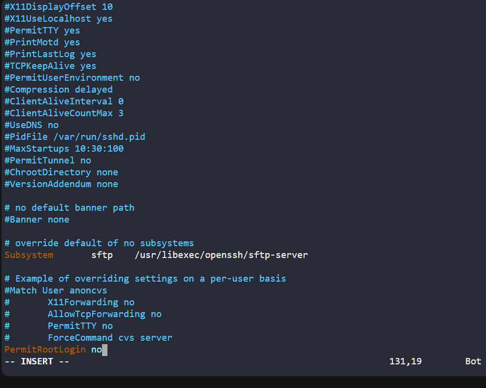
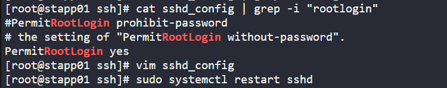
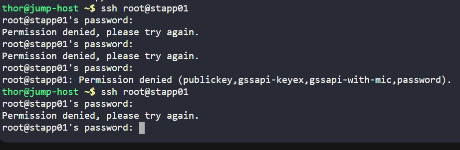
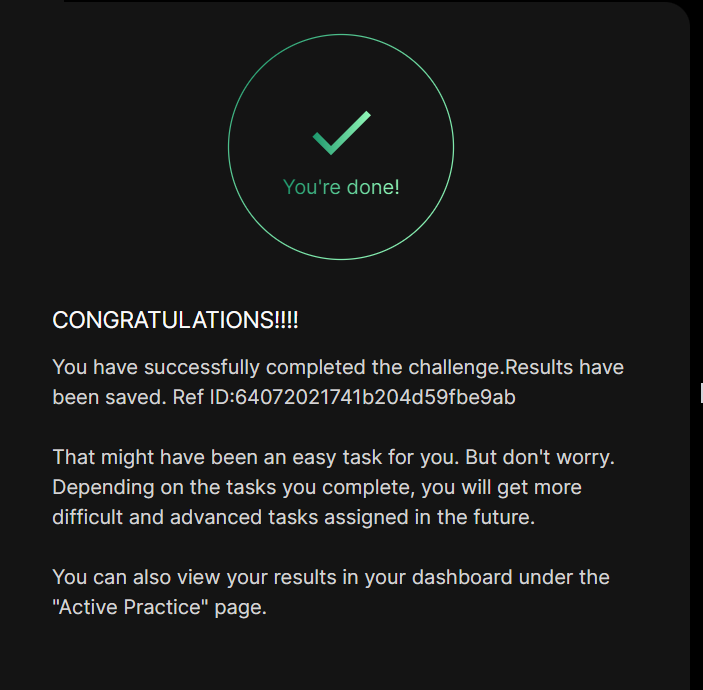

# Day 07 :shipit:

## Task

## Commands Used

ssh into the server and you need root access 
- 

go the /etc/ssh/ and cat sshd_config | grep -i "rootlogin"
- 

change the RootLogin to no
- 

restart the sshd
- 

test root login on app1 and it workined root user is not able to login
- 


followed the same steps on other two servers

## What I Learned

- Direct SSH root login can be controlled using the `PermitRootLogin` setting in `/etc/ssh/sshd_config`.
- Setting `PermitRootLogin no` disables direct SSH login for the `root` user.
- Other users can still log in through SSH if their access is allowed.
- Users with sudo privileges can still switch to root after logging in with their own account.
- Restarting the `sshd` service is required after changing the SSH configuration.

## Notes

- Disabled direct root SSH login on all app servers.
- Updated the SSH configuration file on each app server.
- Restarted the SSH service so the configuration change could take effect.
- Verified that direct root SSH login was blocked while normal user SSH access remained available.

## Command

- got these commands from the chat gpt
```bash
sudo sed -i 's/^#\?PermitRootLogin.*/PermitRootLogin no/' /etc/ssh/sshd_config
sudo systemctl restart sshd
sudo grep -i "^PermitRootLogin" /etc/ssh/sshd_config
```


