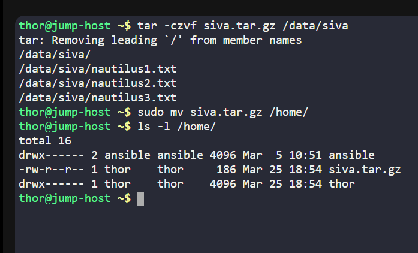
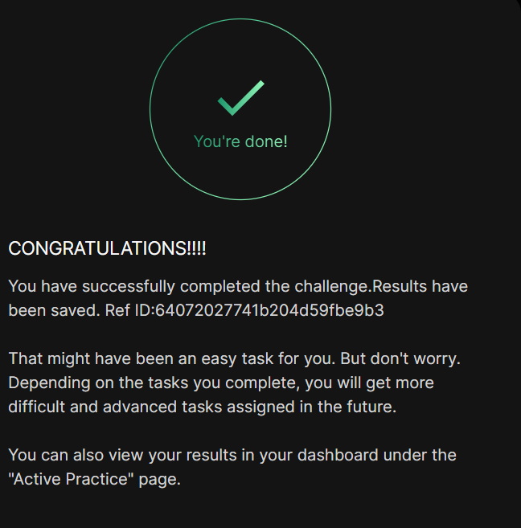

# Day 08 :shipit:

## Task
The jump host server hosts a directory named /data, serving as a repository for various developers non-confidential data. Developer siva has requested a copy of their data stored in /data/siva. The System Admin team has provided the following steps to fulfill this request:

a. Create a compressed archive named siva.tar.gz of the /data/siva directory.

b. Transfer the archive to the /home directory on the Jump Host Server.

## Commands Used


```
# Create compressed archive
tar -czvf siva.tar.gz /data/siva

# Move archive to /home (requires root permission)
sudo mv siva.tar.gz /home/

# Verify file in /home
ls -l /home/
```

Step 1: Create compressed archive

Step 2: Move archive to /home

Verify
- 

## 📘 What I Learned

- How to create compressed archives using the `tar` command  
- Understanding of tar flags:
  - `-c` → create archive  
  - `-z` → compress using gzip  
  - `-v` → verbose output  
  - `-f` → specify filename  
- Importance of correct file paths while archiving directories  
- Handling permission issues when moving files to restricted directories like `/home`  
- Using `sudo` to perform operations requiring elevated privileges  

---

## 📝 Notes

- Always verify the directory path before creating an archive  
- `/home` directory is usually owned by root → requires `sudo` to write  
- Archive name must match exactly as per requirement (e.g., `siva.tar.gz`)  
- The warning `Removing leading '/'` is normal and not an error  
- Use `ls -l` to confirm file movement  


