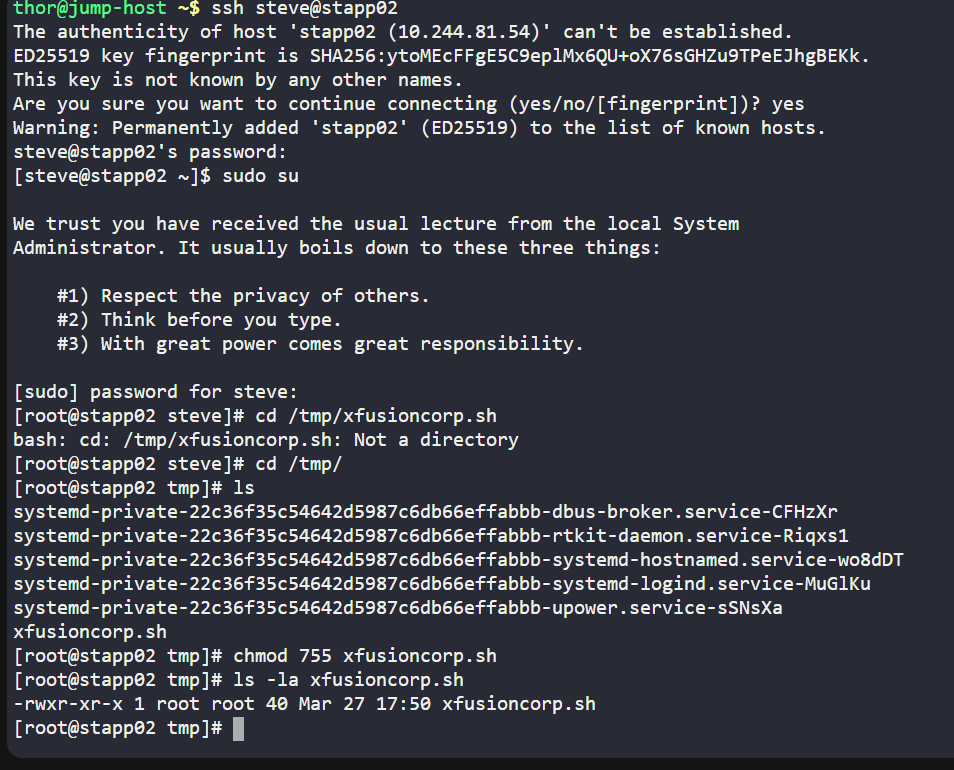
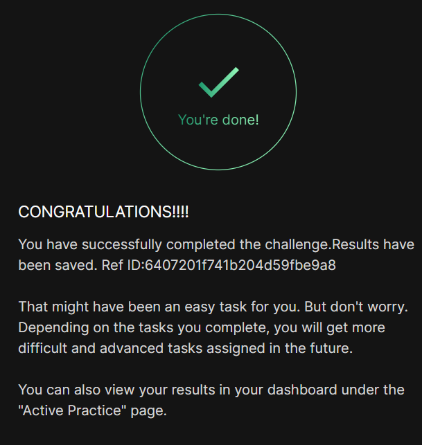

# Day 09 :shipit:

## Task

In a bid to automate backup processes, the xFusionCorp Industries sysadmin team has developed a new bash script named xfusioncorp.sh. While the script has been distributed to all necessary servers, it lacks executable permissions on App Server 2 within the Stratos Datacenter.

Your task is to grant executable permissions to the /tmp/xfusioncorp.sh script on App Server 2. Additionally, ensure that all users have the capability to execute it.

## Commands Used

ssh into the server/ cd into the path check the file permission chmod 755/ added executeable permission to all users
- 

## What I Learned

## Notes

