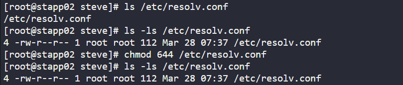
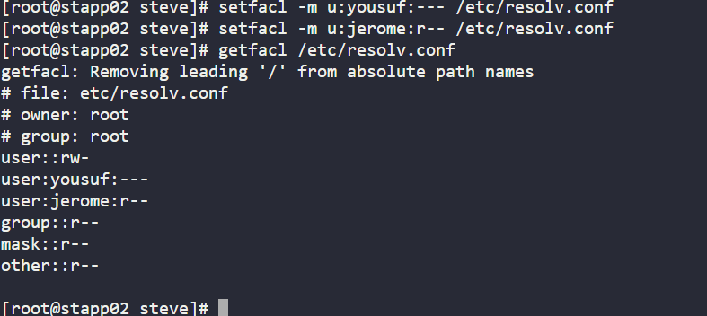
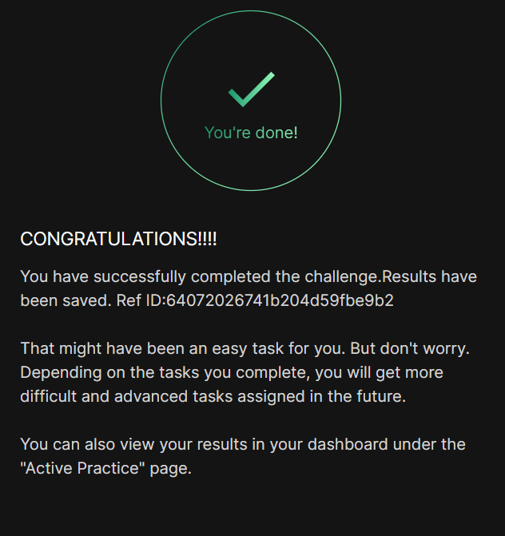

# Day 010 :shipit:

## Task

## Commands Used

```
sudo chown root:root /etc/resolv.conf
sudo chmod 644 /etc/resolv.conf
sudo setfacl -m u:yousuf:--- /etc/resolv.conf
sudo setfacl -m u:jerome:r-- /etc/resolv.conf

```

ssh into the server checked the file permision for user and group


set the acl persmission using  (setfacl -m (modify ) u:jarvis:rwx /path/of/files)

check the status getfacl /etc/hosts

- 

## What I Learned

- ACL (Access Control List) allows setting user-specific permissions beyond standard Linux permissions.
- `chmod 644` gives read-only access to group and others.
- Removing ACL (`-x`) does not deny access if permissions are inherited from "others".
- Explicit deny using `---` is required to fully restrict a user.
- ACL entries override standard file permissions.

## Notes

- Set ownership of `/etc/resolv.conf` to root.
- Ensured others have read-only access using `chmod 644`.
- Denied all access to user `yousuf` using ACL.
- Granted read-only access to user `jerome` using ACL.
- Verified permissions using `getfacl`.

