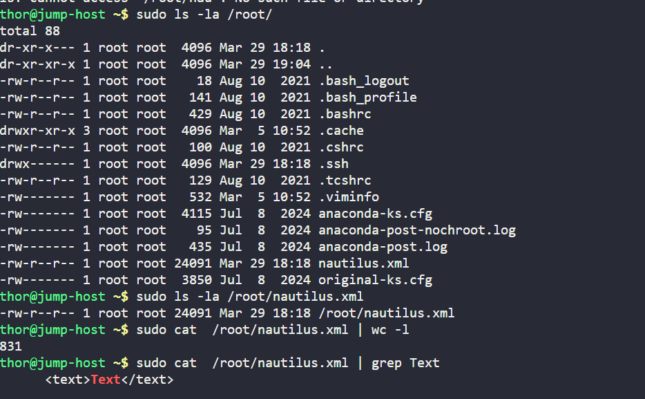
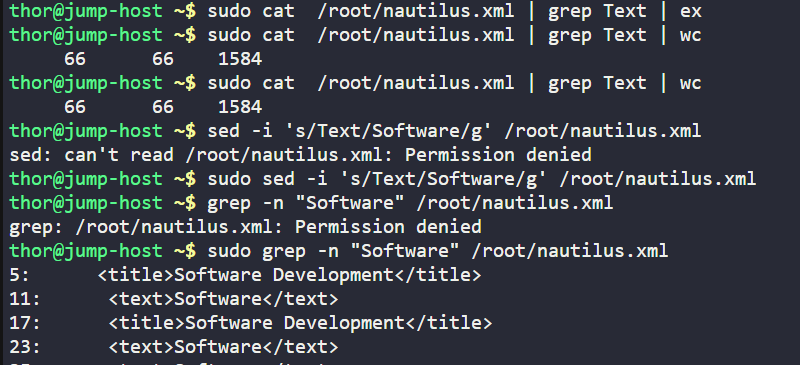

# Day 11 :shipit:

## Task

At xFusionCorp Industries, the Stratos Datacenter houses a jump host server that stores template XML files essential for the Nautilus application. Prior to their use, these files need to be populated with valid data. As part of regular maintenance, the system administration team utilizes various string and file manipulation commands to prepare these templates.

Your task is to substitute all occurrences of the string Text with Software within the XML file located at /root/nautilus.xml on the jump host server.

## Commands Use

```
# Backup the original file
cp /root/nautilus.xml /root/nautilus.xml.bak

# Replace all occurrences of "Text" with "Software"
sed -i 's/Text/Software/g' /root/nautilus.xml

# Verify the replacement
grep "Software" /root/nautilus.xml
```


check the file


check the count/word and update the word
- 

## What I Learned
- How to create a backup of a file using `cp`.
- How to use `sed` to replace all occurrences of a string in a file.
- How to verify changes in a file using `grep`.

## Notes
```bash
# Backup the original file
cp /root/nautilus.xml /root/nautilus.xml.bak

# Replace all occurrences of "Text" with "Software"
sed -i 's/Text/Software/g' /root/nautilus.xml

# Verify the replacement
grep "Software" /root/nautilus.xml