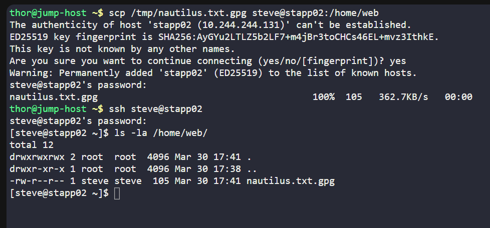

# Day 12 :shipit:

## Task
A Nautilus developer has stored confidential data on the jump host within Stratos DC. To ensure security and compliance, this data must be transferred to one of the app servers. Given developers lack direct access to these servers, the system admin team has been enlisted for assistance.

Copy /tmp/nautilus.txt.gpg file from jump server to App Server 2 placing it in the directory /home/web.

## Commands Used

```
scp /tmp/nautilus.txt.gpg tony@stapp02:/home/web/
```



## What I Learned
- How to securely transfer files between servers using the `scp` command
- Understanding the structure of an `scp` command (source → destination)
- How to copy files from a jump server to a remote application server
- No need for direct login to the target server when using `scp`
- Importance of correct user and host details during file transfer


## Notes
- Replace `tony` with the correct username if needed  
- Ensure `/home/web/` exists on App Server 2  
- Enter password when prompted  
- `scp` uses SSH for secure transfer  
- Run the command from the jump server  