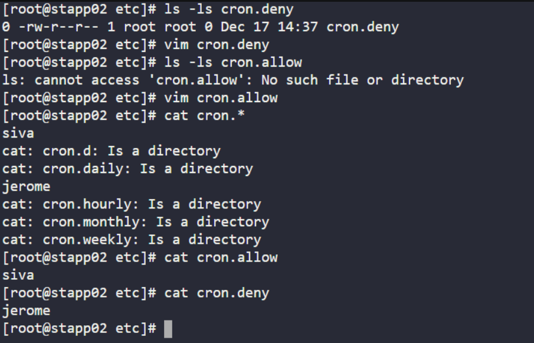
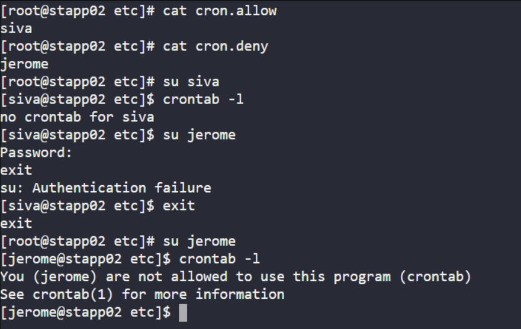

# Day 13 :shipit:

## Task

## Commands Used

```
ssh user@app-server-2
sudo su -
vi /etc/cron.allow
# added: siva

vi /etc/cron.deny
# added: jerome

su - siva
crontab -l

su - jerome
crontab -l
```

ssh into the appserver/edit the cron.deny file and created vim cron.allow 
- 
switch the user siva and jerome and check the crontab -l access
- 


## What I Learned
- Learned how to control user access to cron jobs using `/etc/cron.allow` and `/etc/cron.deny`.
- Understood that `/etc/cron.allow` takes precedence over `/etc/cron.deny`.
- Gained knowledge of implementing least-privilege access for better security compliance.
- Practiced configuring user-specific permissions for scheduled tasks on a Linux server.

## Notes
- `/etc/cron.allow` acts as a whitelist; only listed users can use crontab.
- `/etc/cron.deny` acts as a blacklist and is only effective if `cron.allow` does not exist.
- No service restart is required after modifying these files.
- Always verify access by switching users and running `crontab -l`.
- Useful for restricting unauthorized cron job creation in production environments.


