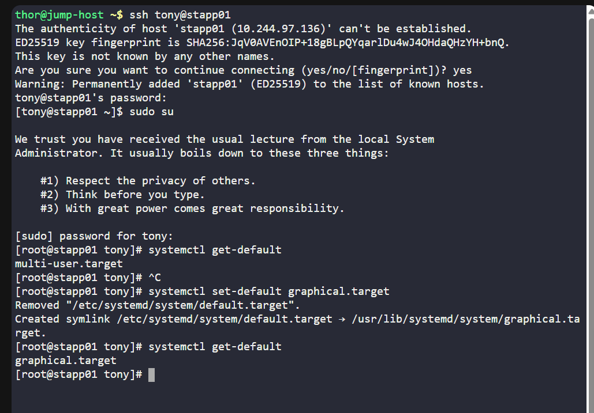
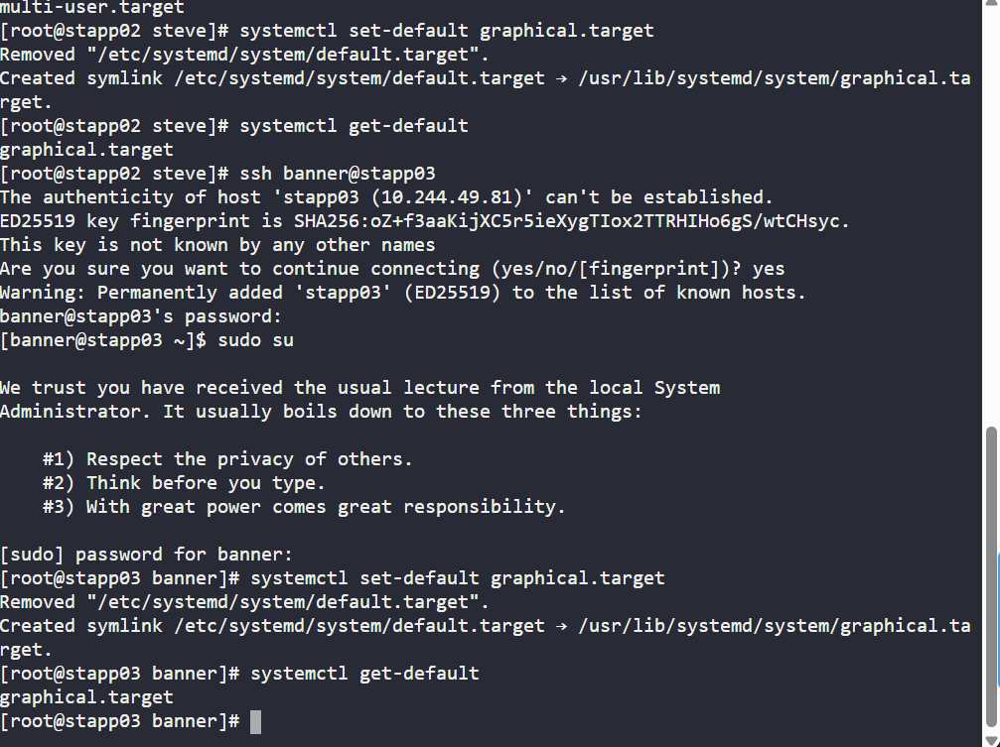
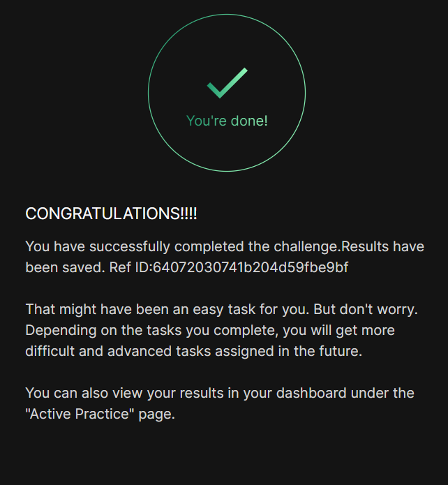

# Day 14 :shipit:

## Task

With the installation of new tools on the app servers within the Stratos Datacenter, certain functionalities now necessitate graphical user interface (GUI) access.


Adjust the default runlevel on all App servers in Stratos Datacenter to enable GUI booting by default. It's imperative not to initiate a server reboot after completing this task.

## Commands Used

```
systemctl get-default
sudo systemctl set-default graphical.target
systemctl get-default

```


ssh into the server/check the default-target update the set-default graphical.target /check the status again did the same on all server
- 

- 

## What I Learned

- Linux systems use **targets/runlevels** to define boot modes
- `multi-user.target` = CLI mode (no GUI)
- `graphical.target` = GUI mode
- Default boot target can be changed using `systemctl`
- No reboot is required to set the default target
- This change ensures servers boot into GUI automatically on next restart

---

## Notes

- App servers currently boot in CLI mode
- Need to switch default target to GUI (`graphical.target`)
- Do NOT reboot servers after making the change
- This only changes future boot behavior, not current session
- Must perform on **all app servers**


