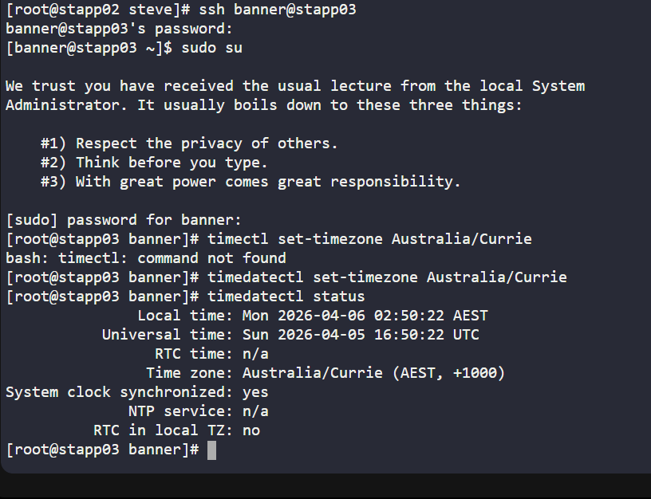
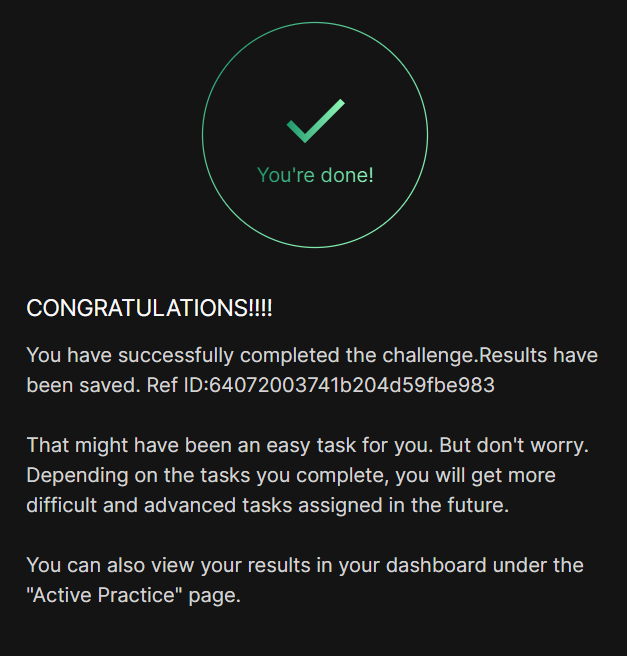

# Day 15 :shipit:

## Task

In the daily standup, it was noted that the timezone settings across the Nautilus Application Servers in the Stratos Datacenter are inconsistent with the local datacenter's timezone, currently set to Australia/Currie.

Synchronize the timezone settings to match the local datacenter's timezone (Australia/Currie).

## Commands Used


```
# Step 1: Check current timezone
timedatectl status

# Step 2: Set the timezone
timedatectl set-timezone Australia/Currie

# Step 3: Verify the change
timedatectl status
```




## What I Learned

## Notes

timedatectl is available on modern Linux systems (CentOS 7+, Ubuntu 16+)

Manual symlink method works on older or minimal systems (like Alpine, BusyBox)

Always verify after setting — just setting /etc/timezone alone is not enough; the symlink is what the OS actually uses

No reboot required — changes take effect immediately


