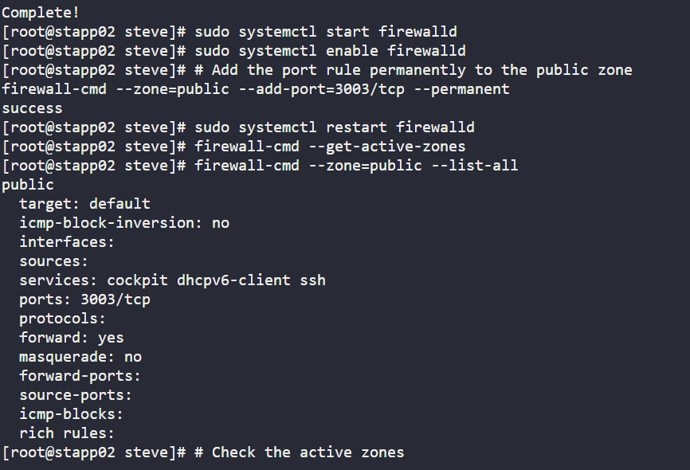
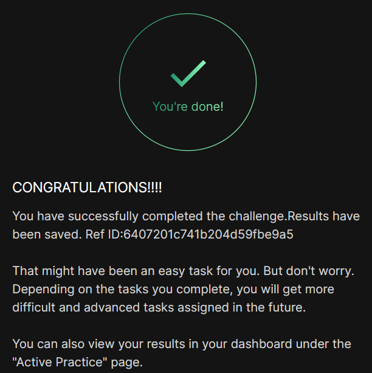

# Day 06 :shipit:

## Task

The Nautilus system administrators team has rolled out a web UI application for their backup utility on the Nautilus application server 2 within the Stratos Datacenter. This application runs on port 3003and appropriate firewall rules must be configured to allow incoming traffic. To achieve this, firewalld needs to be installed and configured on the application server. To ensure proper functionality, the following requirements have been identified:

Install and enable the firewalld service.
Allow all incoming connections on port 3003/tcp.
Ensure the zone is set to public.

## Commands Used

```
# 1. Install firewalld
yum install -y firewalld

# 2. Start and enable the service
systemctl start firewalld
systemctl enable firewalld

# 3. Add port 3003/tcp to public zone permanently
firewall-cmd --zone=public --add-port=3003/tcp --permanent

# 4. Reload to apply changes
firewall-cmd --reload

# 5. Verify
firewall-cmd --zone=public --list-all
```


## What I Learned

## Notes

FlagMeaning--zone=publicApplies rule to the public zone--add-port=3003/tcpOpens port 3003 for TCP traffic--permanentMakes the rule persist after reboot--reloadApplies permanent rules without restarting firewalld

Always use --permanent flag so rules survive reboots

Always run --reload after adding permanent rules

systemctl enable ensures firewalld auto-starts on boot

