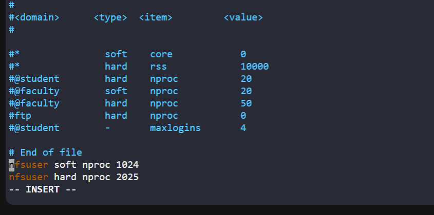
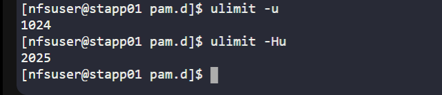
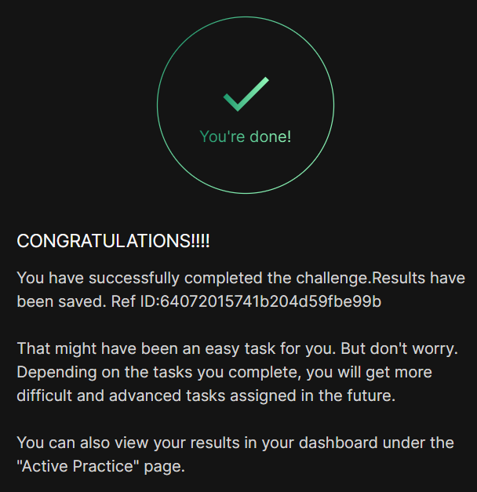

# Day 17 :shipit:

## Task

In the Stratos Datacenter, our application server 1 is encountering performance degradation due to excessive processes held by the nfsuser user. To mitigate this issue, we need to enforce limitations on its maximum processes. Please set the maximum process limits as specified below:

a. Set the soft limit to 1024

b. Set the hard limit to 2025
## Commands Used
```

ps -u nfsuser
ps aux
sudo vim /etc/security/limits.conf
ulimit -u
ulimit -Hu
```

edited the /etc/security/limits/conf save and exit




## What I Learned

- A **process limit (nproc)** controls how many processes a user can run simultaneously on a Linux system.
- There are two types of limits:
  - **Soft limit**: Default active limit; can be increased by the user up to the hard limit.
  - **Hard limit**: Maximum cap; only root can modify it.
- Excessive processes from a user (e.g., `nfsuser`) can degrade system performance.
- Even if no issue is currently visible (`ps aux` shows normal output), limits should still be enforced as a **preventive measure**.
- The `/etc/security/limits.conf` file is used to define user-level process limits.
- PAM (`pam_limits.so`) must be enabled to enforce these limits.

---

## Notes

- To set process limits for a user:
  ```
  nfsuser soft nproc 1024
  nfsuser hard nproc 2025
  ```

