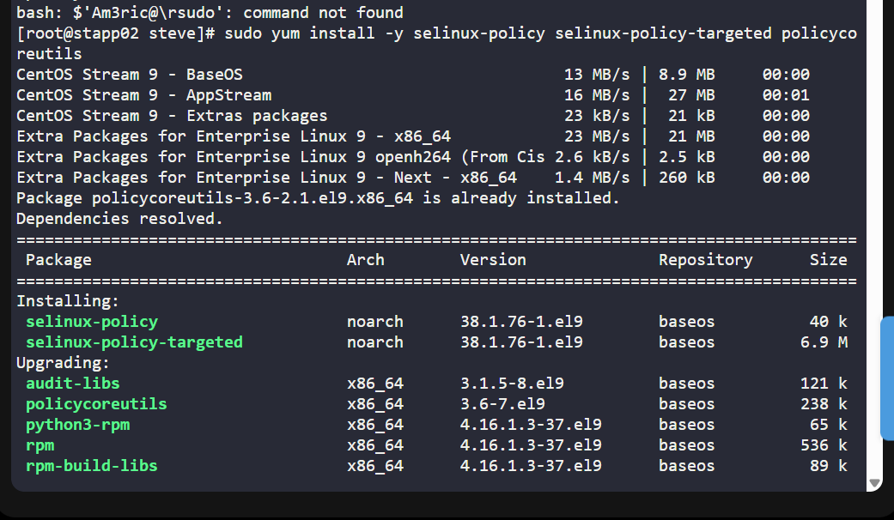
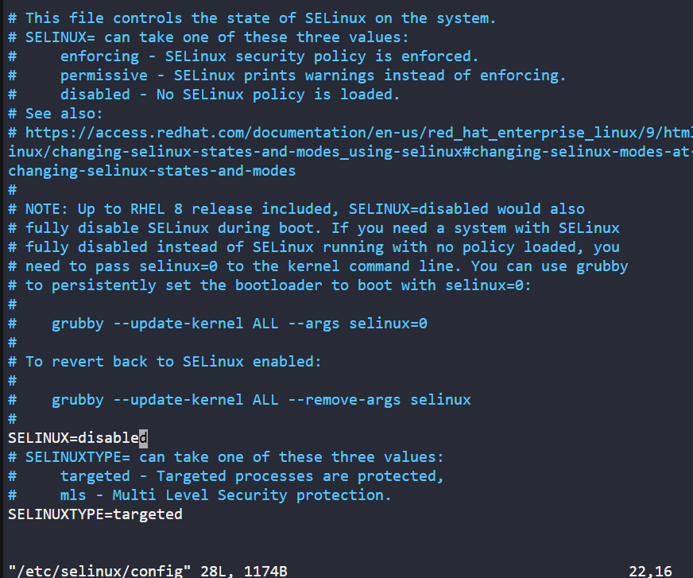
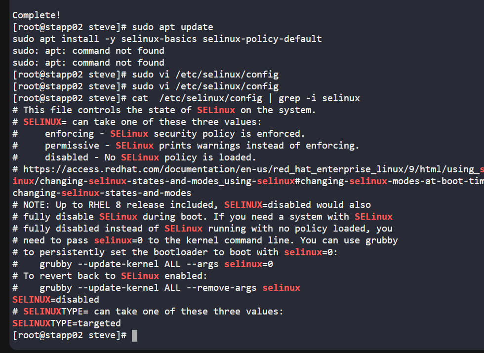
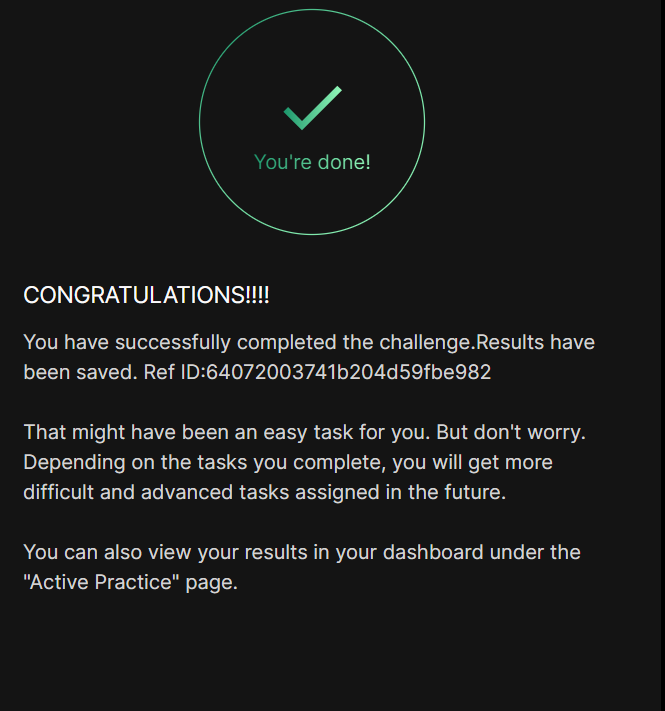

# Day 00 :shipit:

## Task

Following a security audit, the xFusionCorp Industries security team has opted to enhance application and server security with SELinux. To initiate testing, the following requirements have been established for App server 2 in the Stratos Datacenter:


Install the required SELinux packages.

Permanently disable SELinux for the time being; it will be re-enabled after necessary configuration changes.

No need to reboot the server, as a scheduled maintenance reboot is already planned for tonight.

Disregard the current status of SELinux via the command line; the final status after the reboot should be disabled.

## Commands Used

install the required package


edited this option enforced to disabled
- 

check
- 
## What I Learned

- Installed required SELinux packages on a Linux server  
- Understood SELinux modes: **enforcing**, **permissive**, and **disabled**  
- Learned how to **permanently disable SELinux** via configuration file  
- Used `/etc/selinux/config` for persistent changes instead of runtime commands  
- Realized that SELinux changes apply **only after reboot**  
- Followed task instructions strictly (no immediate reboot required)
## Notes

permanently disable SELinux:
- SELinux configuration file:
  ```bash
  /etc/selinux/config
  ```



