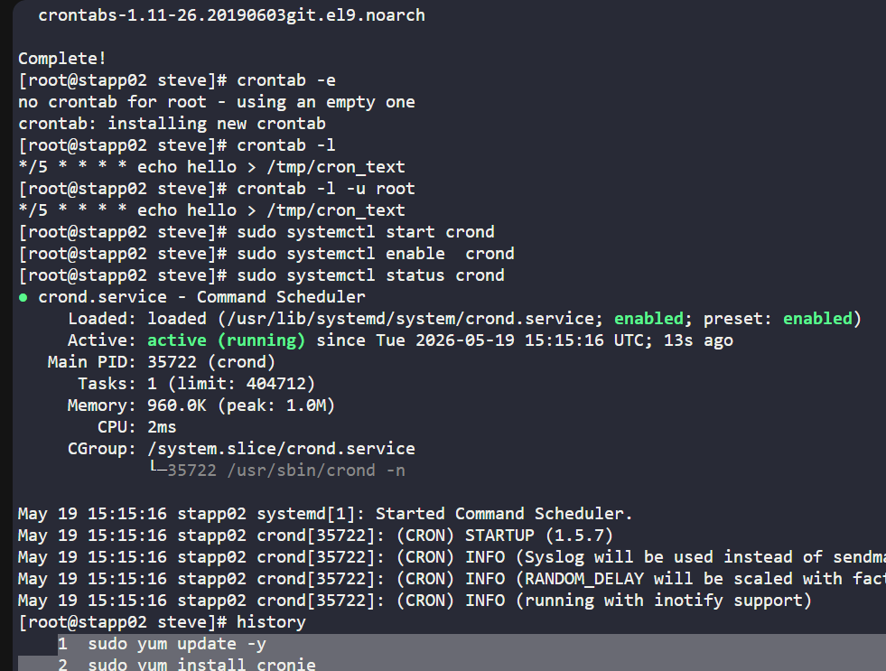
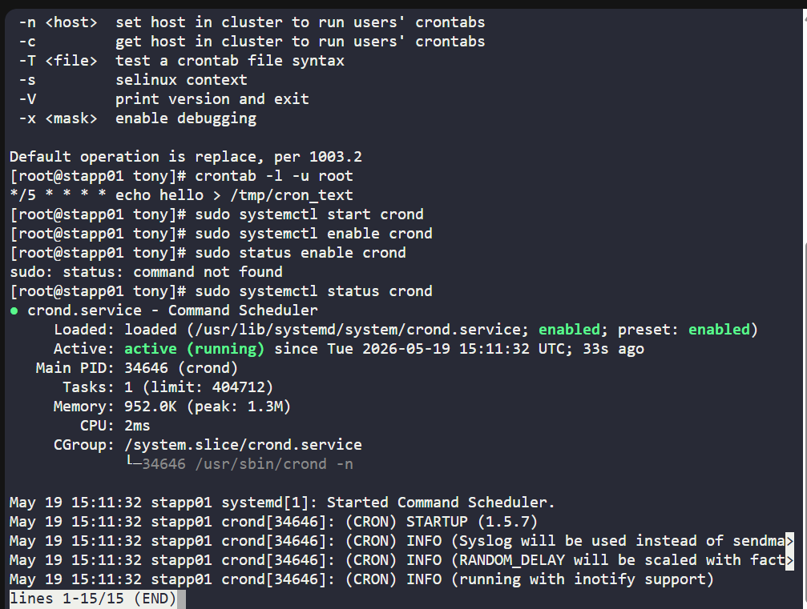
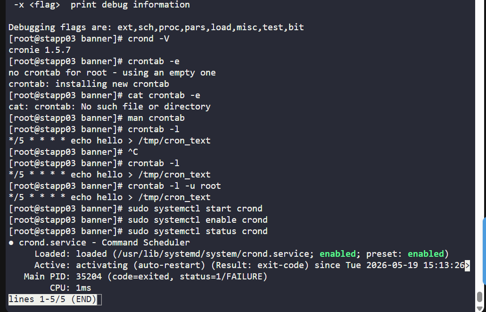
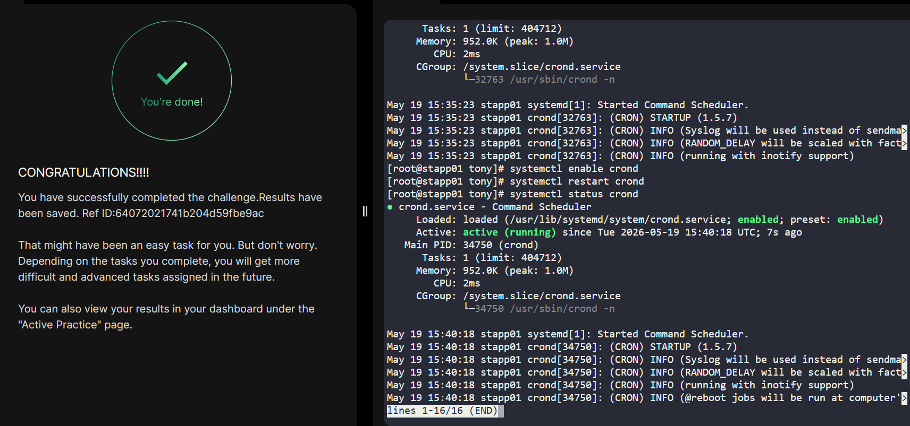

# Day 01
:shipit:

## Task
The Nautilus system admins team has prepared scripts to automate several day-to-day tasks. They want them to be deployed on all app servers in Stratos DC on a set schedule. Before that they need to test similar functionality with a sample cron job. Therefore, perform the steps below:


a. Install cronie package on all Nautilus app servers and start crond service.


b. Add a cron */5 * * * * echo hello > /tmp/cron_text for root user.

## Commands Used
```
1  sudo yum update -y
    2  sudo yum install cronie
    3  crontab -e
    4  crontab -l 
    5  crontab -l -u root
    6  sudo systemctl start crond
    7  sudo systemctl enable  crond
    8  sudo systemctl status crond
    9  history
```





## What I Learned

## Notes


