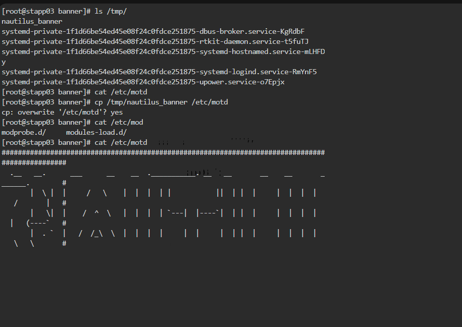
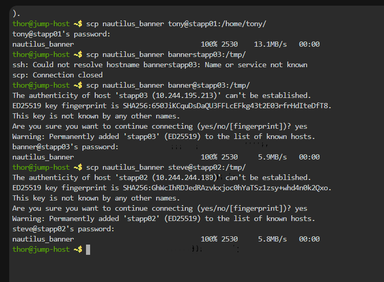
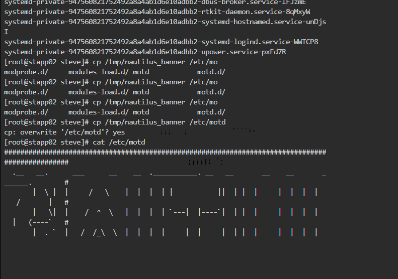
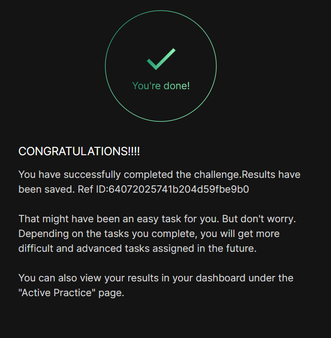

# Day 02
:shipit:

## Task
During the monthly compliance meeting, it was pointed out that several servers in the Stratos DC do not have a valid banner. The security team has provided serveral approved templates which should be applied to the servers to maintain compliance. These will be displayed to the user upon a successful login.


Update the message of the day on all application servers for Nautilus. Make use of the approved template located at /home/thor/nautilus_banner on the jump host.

## Commands Used

```
scp nautilus_banner tony@stapp01:/home/tony/

ssh stapp01
sudo cp /tmp/nautilus_banner /etc/motd
exit

ssh stapp02
sudo cp /tmp/nautilus_banner /etc/motd
exit

ssh stapp03
sudo cp /tmp/nautilus_banner /etc/motd
exit444

```






## What I Learned

## Notes


