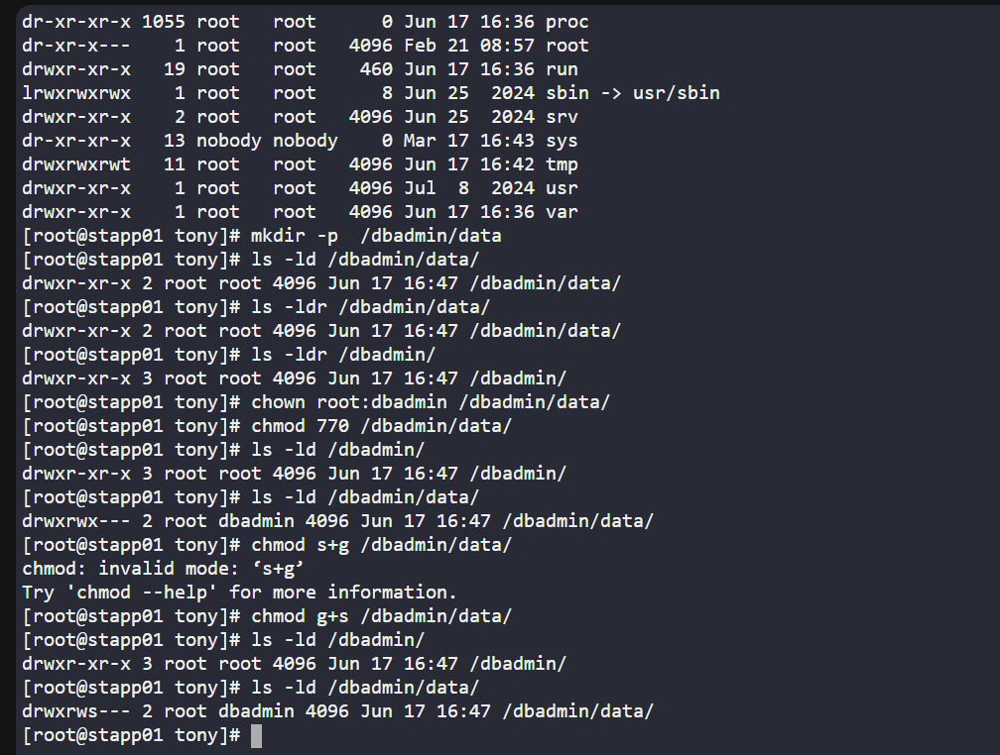

# Day 03
:shipit:

## Task

The Nautilus team doesn't want its data to be accessed by any of the other groups/teams due to security reasons and want their data to be strictly accessed by the sysadmin group of the team.


Setup a collaborative directory /sysadmin/data on app server 1 in Stratos Datacenter.


The directory should be group owned by the group sysadmin and the group should own the files inside the directory. The directory should be read/write/execute to the user and group owners, and others should not have any access.

## Commands Used




## What I Learned

## Notes


# Linux SetUID & SetGID Cheat Sheet

## SetUID (u+s)

### Purpose

Runs a program with the **file owner's permissions**.

### Command

```bash
chmod u+s <file>
```

### Numeric Value

```bash
4xxx
```

Example:

```bash
chmod 4755 myscript
```

### Identify

```bash
-rwsr-xr-x
```

`s` in the **owner** field.

### Common Use Case

```bash
/usr/bin/passwd
```

Allows normal users to update `/etc/shadow` using root privileges.

### Memory Trick

```text
u+s = User ID
4 = SetUID
```

---

## SetGID (g+s)

### Purpose

* On files → Runs with the file's group permissions.
* On directories → New files inherit the directory's group.

### Command

```bash
chmod g+s <directory>
```

### Numeric Value

```bash
2xxx
```

Example:

```bash
chmod 2770 /dbadmin/data
```

### Identify

```bash
drwxrws---
```

`s` in the **group** field.

### Common Use Case

Shared team directories:

```bash
/dbadmin/data
```

All new files automatically belong to group `dbadmin`.

### Memory Trick

```text
g+s = Group ID
2 = SetGID
```

---

## Quick Comparison

| Permission | Command          | Number | Use Case           |
| ---------- | ---------------- | ------ | ------------------ |
| SetUID     | `chmod u+s file` | 4      | Run as file owner  |
| SetGID     | `chmod g+s dir`  | 2      | Shared directories |

---

## Most Important Example

```bash
mkdir -p /dbadmin/data
chown root:dbadmin /dbadmin/data
chmod 2770 /dbadmin/data
```

Result:

```bash
drwxrws---
```

✅ Owner: Full Access
✅ Group: Full Access
✅ Others: No Access
✅ New files inherit `dbadmin` group

```
```
## 