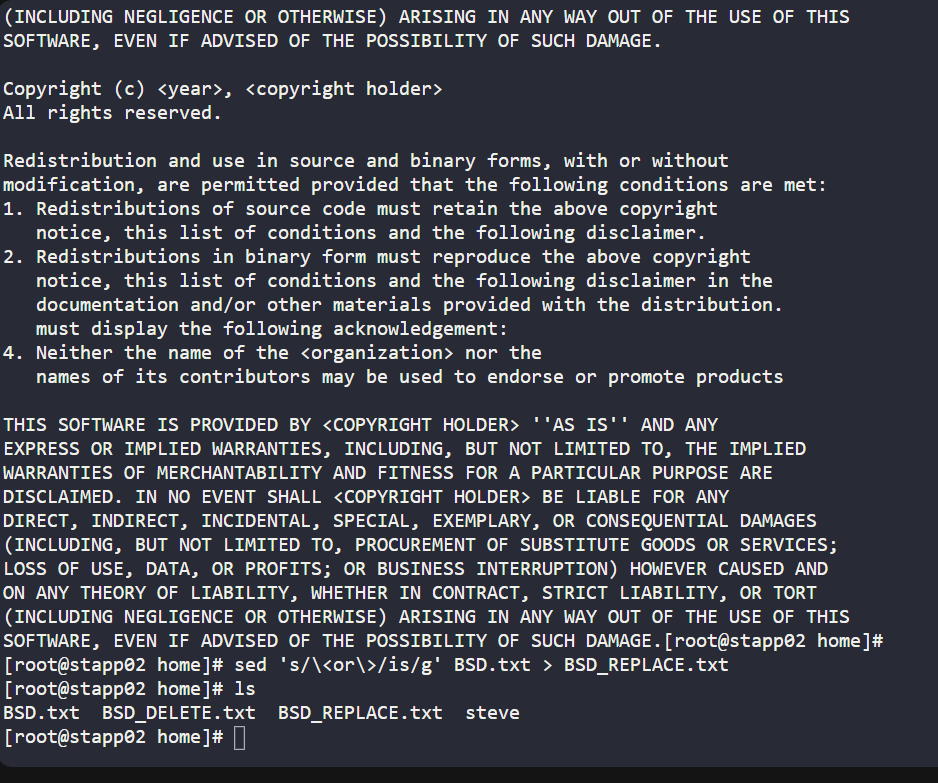
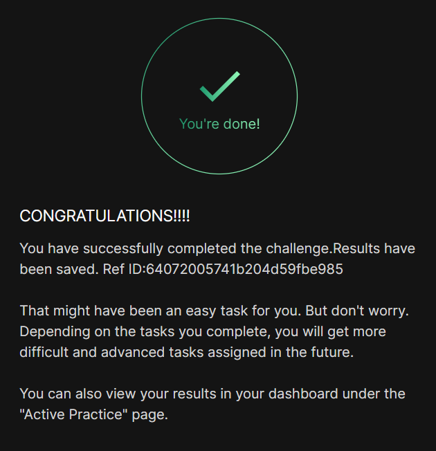

# Day 04
:shipit:

## Task
There is some data on Nautilus App Server 2 in Stratos DC. Data needs to be altered in several of the files. On Nautilus App Server 2, alter the /home/BSD.txt file as per details given below:


a. Delete all lines containing word software and save results in /home/BSD_DELETE.txt file. (Please be aware of case sensitivity)


b. Replace all occurrence of word or to is and save results in /home/BSD_REPLACE.txt file.


Note: Let's say you are asked to replace word to with from. In that case, make sure not to alter any words containing the string itself; for example upto, contributor etc.

## Commands Used

```
sed '/software/d' /home/BSD.txt > /home/BSD_DELETE.txt


Replace only the whole word or with is

sed 's/\<or\>/is/g' /home/BSD.txt > /home/BSD_REPLACE.txt
```


## What I Learned

## Notes

```
Why use word boundaries?

Without boundaries:

sed 's/or/is/g'

would change:

world order

to

wisld isder

which is incorrect.

Using \<or\> ensures only the standalone word or is replaced:

this or that

becomes

this is that

while words like:

order
world

remain unchanged.

```


