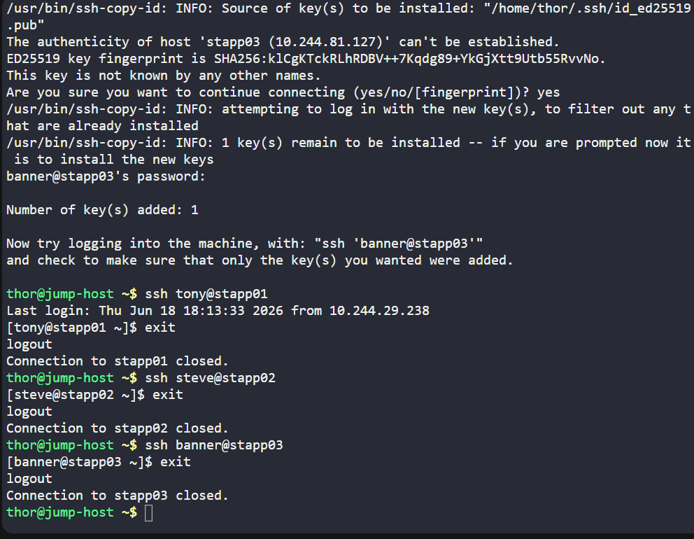
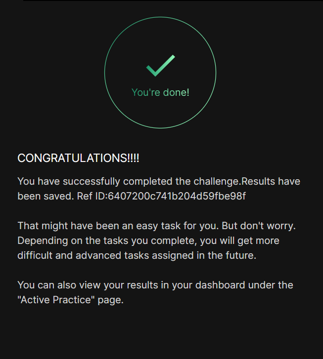

# Day 05
:shipit:

## Task

The system admins team of xFusionCorp Industries has set up some scripts on jump host that run on regular intervals and perform operations on all app servers in Stratos Datacenter. To make these scripts work properly we need to make sure the thor user on jump host has password-less SSH access to all app servers through their respective sudo users (i.e tony for app server 1). Based on the requirements, perform the following:


Set up a password-less authentication from user thor on jump host to all app servers through their respective sudo users.

## Commands Used

```

ssh-keygen

ssh-copy-id tony@stapp01 yes password 
then 
try ssh access
ssh tony@stapp01
BOom

```


## What I Learned

## Notes


