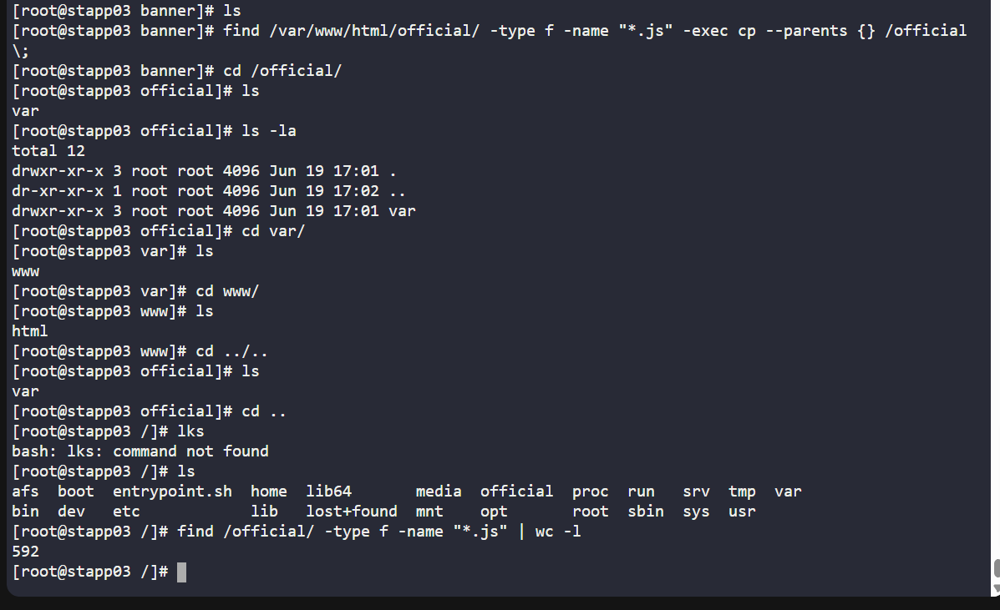
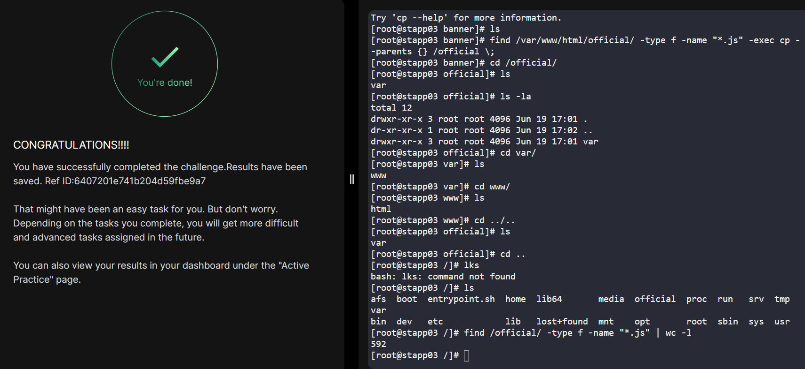

# Day 06
:shipit:

## Task

During a routine security audit, the team identified an issue on the Nautilus App Server. Some malicious content was identified within the website code. After digging into the issue they found that there might be more infected files. Before doing a cleanup they would like to find all similar files and copy them to a safe location for further investigation. Accomplish the task as per the following requirements:


a. On App Server 2 at location /var/www/html/news find out all files (not directories) having .php extension.


b. Copy all those files along with their parent directory structure to location /news on same server.


c. Please make sure not to copy the entire /var/www/html/news directory content.

## Commands Used

```
find /var/www/html/ -type f -name "*.js" | wc -l

find /var/www/html/ -type f -name "*.js" -exec cp --parents {} /news \;

```



## What I Learned

## Notes
