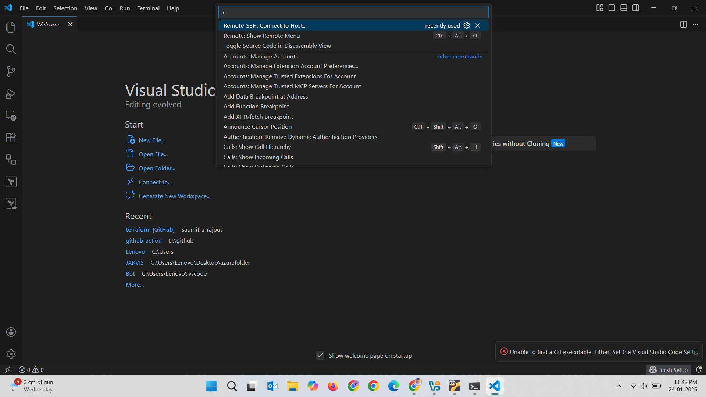
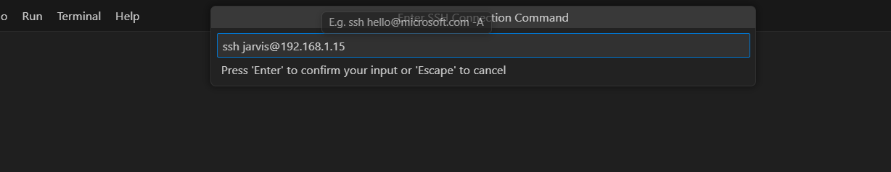
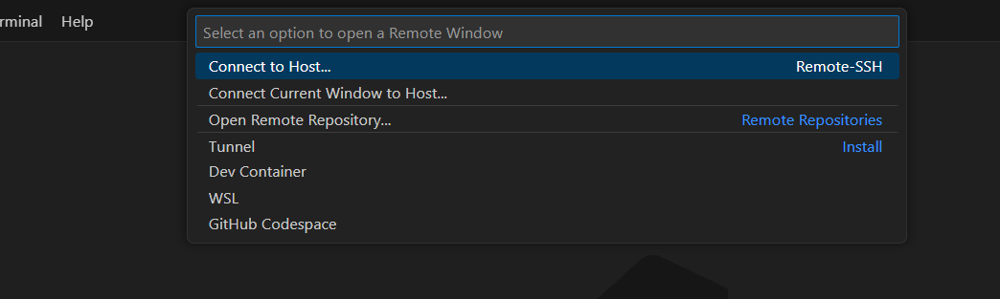
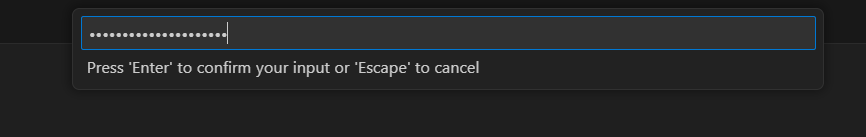
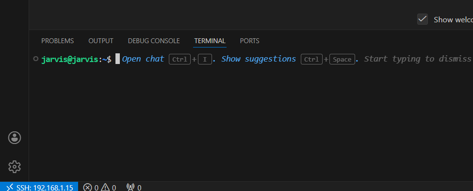

## setting up vscode terminal to use linux server.

- I have a ubuntu linux server
- I have vs code on my local machine.
- I wanted to use my linux terminal on vs-code because my gh is already login to see the realtime updates on code and directories.
- I wanted to use code file.txt command to open file in vs-code

## Steps

- Open vs code

`type ctrl + shift + P`
 
 - Select Remote-SSH: Connect to Host
 

 - Config the remote host

 - Again `type ctrl + shift + P`

 

 - Enter your password

 

## BOOM!!!
### you are all set when you see this on the left bottom
